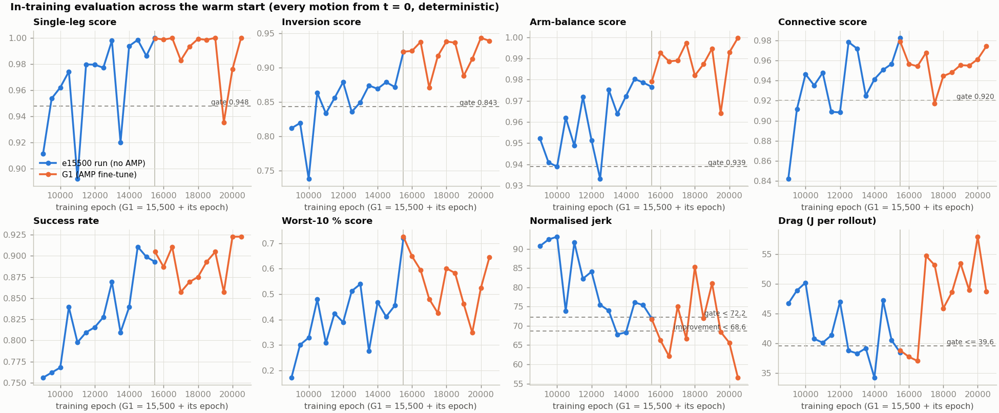
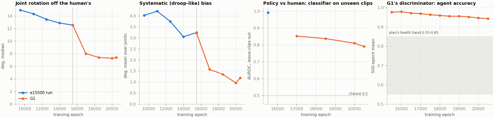
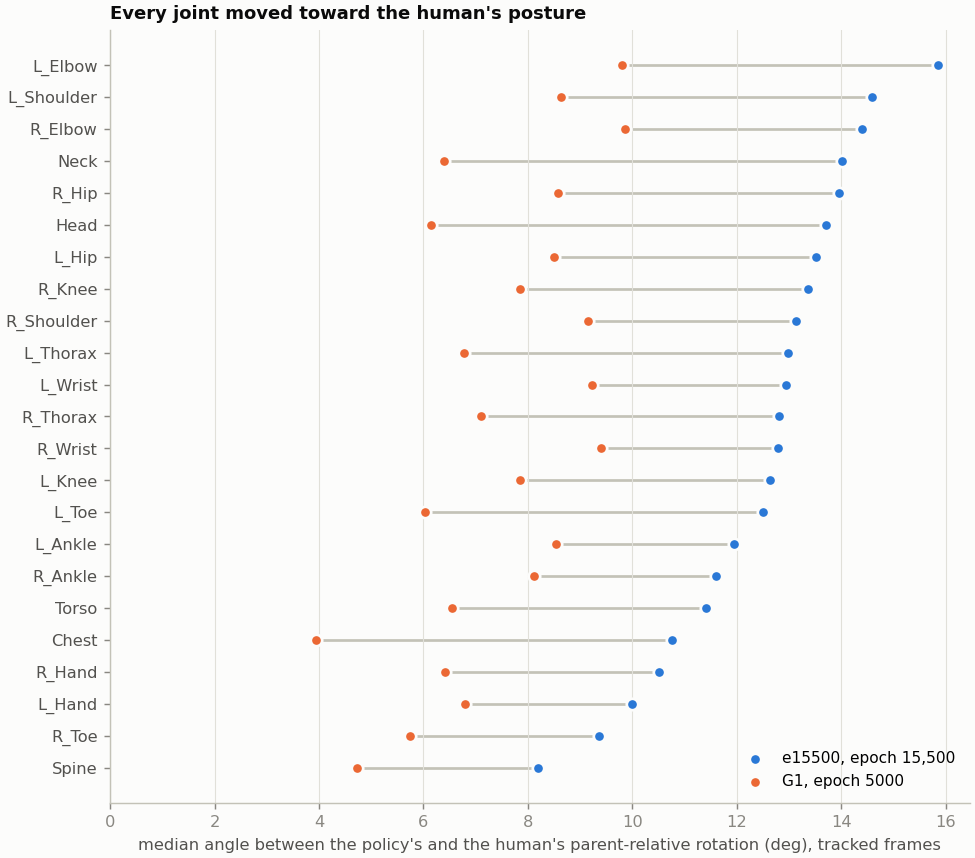
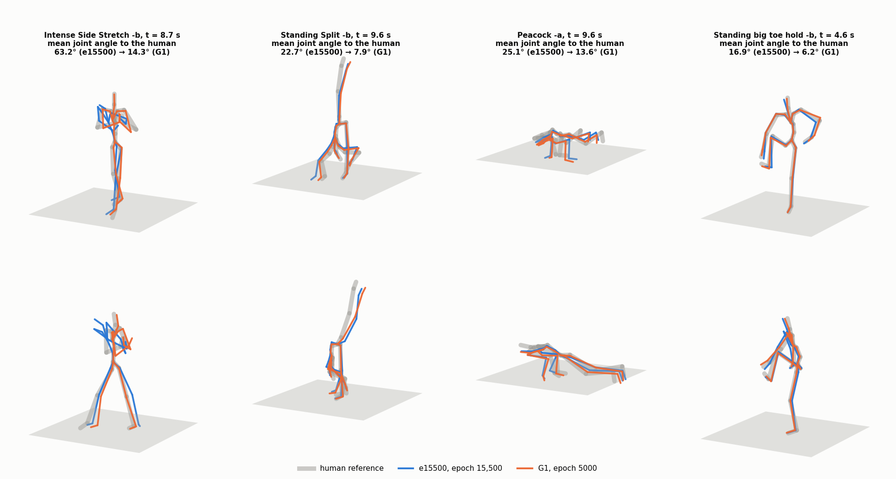
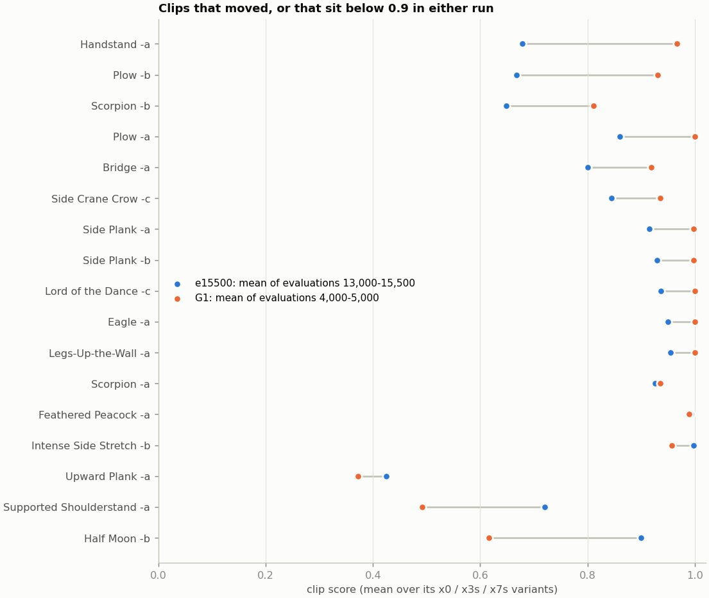

# G1, the AMP warm-start fine-tune, evaluated (2026-10-04)

Run `smpl_yogi_v2_expert56_amp_ft_a2dda5d2ac` (wandb `sfgpfbn5`) is graph-growth Step 1
([`../PLAN.MD`](../PLAN.MD), card G1). It is the release-v2 expert of epoch 15,500
([`../../expert56_v2_e15500/README.MD`](../../expert56_v2_e15500/README.MD), "e15500" below) warm-started for 5,000
epochs with an AMP style reward added to every existing term. This folder evaluates it against e15500 with the same
instruments, and renders the same 20 clips.

**Read this first: what is and is not attributable to AMP.** G1 differs from e15500 in three ways at once: the AMP
reward, 5,000 more epochs of training, and E1's support rule v2 steering the curriculum's sampling. e15500 had not
converged (README §2), so continued training alone moves scores. The matched control (`CONTROL=1`, the same warm
start without AMP) has not run. This report therefore reads every change against e15500's own trend over its last
6,000 epochs, and names as AMP's only what starts when the AMP weight ramps in (epochs 200–500) and runs far faster
than that trend.

## 0. Bottom line

1. **AMP changed the posture, and by a lot. It did not change the jitter.**
   - The policy's joint rotations now sit a median **7.3–7.4° from the human's (epochs 4,500 and 5,000), against
     12.6° at e15500**. The systematic, droop-like part fell from 3.2° to 1.0–1.2°. All 23 joints and 55 of 56 clips
     moved toward her.
   - Most of the change happened in G1's first 1,500 epochs (12.6° → 8.0°). e15500's own last 6,000 epochs moved
     14.9° → 12.6°, so G1 moved about ten times faster than the run's background trend. That timing is AMP's
     signature.
   - A classifier trained to tell the policy from her, tested on clips it has not seen, falls from AUROC **0.991 to
     0.79–0.81** (epochs 4,500 and 5,000). Arm balance and connective fall the furthest, to 0.73–0.78. What remains
     separable is clip-specific detail, not a shared bias.
   - Smoothness barely moved: action deltas −6 %, jerk within e15500's band across G1's ten evaluations. The plan
     predicted the opposite (jitter would be AMP's visible effect). The e15500 audit had already shown jitter was not
     the gap.
2. **Every pre-registered gate passes except drag.** Read over the evaluations at 4,000 / 4,500 / 5,000:
   - groups: single-leg 0.971, inversion 0.932, arm balance 0.986, connective 0.964 (gates 0.948 / 0.843 / 0.939 /
     0.920);
   - jerk 63.5, which counts as an improvement (< 68.6); high-jerk frames 1.06 %; substitutions 5.7 against the
     force-rule baseline of 6;
   - realisability no worse: float 2.4 % → 1.2–1.8 %, slide unchanged, COM–COP closer to her measured COP at
     epoch 5,000 (3.61 → 3.23 cm);
   - **drag 51.9 J against the 39.6 J gate: fail**;
   - AMP health: the style/task advantage ratio sits at 0.25–0.27 and the AMP reward at 0.50, both inside their
     bands. Discriminator accuracy (0.94) stays above the band E2 showed to be unreachable, but it fell steadily
     from 0.98.
3. **More clips pass, and an exit off the floor now works.**
   - Epoch 5,000 is the best evaluation of either run: success **0.923**, perf score 0.976. Clips below 0.95 fall
     from 9 to 4, and clips that flip by more than 0.2 between evaluations from 13 to 7.
   - **Plow -b now stands up** at the end, in every G1 rollout, after climbing steadily from 0.74 to 0.97 with no
     flips.
   - **Supported Shoulderstand -a lost its shoulderstand, and its get-up is unreliable.** In every G1 rollout it lies
     on its back with the legs raised and the pelvis on the floor, where e15500 held a straight shoulderstand. That
     is the score's drop (0.77 → 0.45; it was 0.93 at epoch 3,500). It stands up at the end in the render and in
     the evaluator's epoch-4,500 rollout, but not in the evaluator's epoch-5,000 rollout. e15500 never stood up.
   - Handstand -a no longer falls at the end: it holds the handstand to the clip's end, though it still never steps
     down. Upward Plank -a still lies down at its exit.
   - Scorpion -b now kicks up and holds the hands-only scorpion that gate v2 called beyond the plant's wrists
     (0.74 → 0.91). Firefly -a lifts into its firefly on time, and its family hold is feet-up.
   - Half Moon -b flips (0.16 at epoch 4,000, 1.00 at 5,000).
4. **The drag regression is a specific habit: closing a too-wide stance by sliding a loaded foot.**
   - The evaluator's drag, recomputed offline to 0.005 J, puts the extra friction work in single 0.4–1 s events
     between holds. Most of it comes after the policy stands back up from Side Plank -a and -b, Plank -a,
     Downward Dog -a and Dolphin Plank. The holds themselves barely drag.
   - In those windows G1 is already upright but arrives with its feet 0.18–0.32 m apart, where hers are 0.11–0.16 m.
     It closes the stance by sliding the left foot inward under 265–303 N, instead of lifting and placing it. Her
     feet stay put.
   - The rest comes from exits that now happen at all: Plow -b's get-up, Shoulderstand -a's roll-down and get-up.
   - The rise started at epoch 1,500, a thousand epochs after the AMP ramp ended, so it is not cleanly AMP's.
5. **The support picture moved without changing its size.**
   - Gone: Side Crow -c's toe kickstand (from epoch 1,000).
   - New by load: Side Plank -a's top foot, already within 2 cm of the floor in e15500's render, carries load from
     epoch 3,000. In the panel's 8.5 s Pincha hold the policy now puts both hands and then one foot down; e15500
     held it on its forearms. That probe regressed at epoch 500, exactly when the AMP ramp completed.
   - Eagle -a's wrapped foot, a sub-1 N hover at e15500, carried real load at most evaluations from 500 to 4,500, though
     not at 5,000.
   - e15500's left-knee hover in the kneeling preparations is mostly fixed: the left knee is down in 11 of 12
     kneeling holds at epochs 1,500 and 5,000 (10 at 3,000, 7 at 4,500), against 2 of 12 at e15500.
6. **For the first time, one fork from standing reaches a hard pose, though not at epoch 5,000.** Commanded from the
   standing start straight into the supported headstand, with the clip's kneeling preparation holds skipped, G1
   places its head and hands, raises its legs, and holds a straight headstand to the end of the goal window:
   - on 100 % of the panel's 341 replicas at epoch 1,500, 96 % at 2,000 and 50 % at 4,500; partly at 500 and 1,000
     (34 %, 25 %); 0–2 % at 3,000–4,000 and at 5,000;
   - no e15500 checkpoint ever reached it (README §6).

   The other forks did not change in kind. The crow fork reads "held" on 100 % of replicas, but that is the pose
   metric's blind spot: contact IoU 0.23, and the stick figure folds forward standing on one foot with no hands down.
   e15500 did exactly this at epoch 14,000 and was scored the same way. Handstand and Pincha forks stay at 0.
7. **Deploy epoch 5,000** (`epoch_5000.ckpt` = `last.ckpt` = `score_based.ckpt`, tensor for tensor). On every group
   it is G1's best evaluation, or within 0.004 of it (inversion 0.939 against 0.943 at 4,500). Against e15500 only
   connective is lower (0.974 against 0.983).
8. **Run the control next.** Only the posture shift and the Pincha-probe regression are time-locked to the AMP
   ramp. The inversion gain, the new get-ups, the extra drag, Shoulderstand -a's lost hold and the new
   substitutions could all come from continued training. `CONTROL=1 bash data/scripts/run_expert_amp_ft.sh`
   settles that in about 13.5 GPU-hours.

## 1. What was run, and what is evaluated

| | |
|---|---|
| Run | `smpl_yogi_v2_expert56_amp_ft_a2dda5d2ac`, wandb `sfgpfbn5`, `data/scripts/run_expert_amp_ft.sh`, launched 2026-10-03 13:51 PDT, finished 2026-10-04 05:16 (5,000 epochs, 15.4 h) |
| Start | `results/smpl_yogi_v2_expert56_a2dda5d2ac/epoch_15500.ckpt` with `--warm-start-optimization-state`; G1's epoch-1 evaluation reproduces e15500's group scores within 0.004 |
| Changes from e15500 | the AMP style reward (heading-free 163-feature windows, x0 demonstrations only, GP 10, weight 0 until epoch 200, calibrated once at 200 to **w = 0.50**, ramped to full by 500; `../e2_amp/README.MD`); `--support-rule v2` for the curriculum's sampling only (`../e1_support_v2/README.MD`); state history 15 → 20 steps for the AMP features. Actor, critic, robot, release and every other reward term unchanged |
| Policy evaluated | `epoch_5000.ckpt`. `last.ckpt` and `score_based.ckpt` hold identical model tensors (51 of 51); its v1 score 0.976 is the run's best |
| Rollout libraries | the evaluator saved them at epochs 1, 1,500, 3,000 and 4,500. The standalone evaluation of epoch 5,000 (§2) wrote a fifth, with ground forces; rows labelled "G1 5,000" use it |

The evaluation reuses e15500's instruments wherever they exist:
- the in-training evaluator's 11 evaluations, against the pre-registered G1 gates (§2) and per clip (§4);
- direct measurements of what AMP acts on, posture and stillness, plus E2's separability classifier (§3);
- per-hold supports and the force-rule substitutions (§5);
- realisability and a frame-by-frame localisation of the drag (§6);
- the goal-conditioned viz panel (§7);
- IsaacLab videos of the same 20 clips, side by side with e15500's (§8).

## 2. The pre-registered gates



The gates are PLAN.MD's G1 card, read as the mean over the last three evaluations (4,000 / 4,500 / 5,000), with E1's
force rule for substitutions (baseline 6, not the review's 10).

| Gate | e15500 (band 13k–15.5k) | G1: 4,000 / 4,500 / 5,000 | Mean | Verdict |
|---|---|---|---|---|
| Single-leg ≥ 0.948 | 1.000 (0.983 ± 0.031) | 0.935 / 0.976 / 1.000 | 0.971 | pass |
| Inversion ≥ 0.843 | 0.923 (0.878 ± 0.024) | 0.913 / 0.943 / 0.939 | 0.932 | pass, above the band |
| Arm balance ≥ 0.939 | 0.977 (0.974 ± 0.006) | 0.964 / 0.993 / 1.000 | 0.986 | pass, above the band |
| Connective ≥ 0.920 | 0.983 (0.955 ± 0.021) | 0.955 / 0.961 / 0.974 | 0.964 | pass |
| Jerk < 72.2 (improvement < 68.6) | 71.9 (72.2 ± 3.6) | 68.4 / 65.6 / 56.5 | 63.5 | improvement (see §3.3) |
| High-jerk frames < 1.30 % | 1.11 (1.30 ± 0.12) | 1.13 / 1.22 / 0.82 | 1.06 | pass |
| Drag ≤ 39.6 J | 38.4 (39.6 ± 4.3) | 48.9 / 57.9 / 48.7 | 51.9 | **fail** (§6) |
| Substitutions, force rule, x0 ≤ 6 | 6 (G1 epoch 1) | 5 / 7 / 5 | 5.7 | pass, composition changed (§5) |
| Realisability no worse | float 2.4 %, slide p90 1.06 cm/s, COM–COP 3.61 cm | 4,500: 1.15 %, 0.95 cm/s, 3.55 cm; 5,000: 1.8 %, 0.99 cm/s, 3.23 cm | — | pass (§6) |
| AMP health: reward 0.3–1.0, style/task advantage std 0.2–0.35 | — | reward 0.50, ratio 0.27 | — | pass |
| Discriminator accuracy 0.55–0.85 | — | agent 0.94, falling from 0.98 | — | unreachable on this corpus (E2) |

Other headline numbers at epoch 5,000 (e15500 in brackets): success 0.923 (0.893), perf score 0.976 (0.972),
track / hold / family hold 0.970 / 0.982 / 0.970 (0.969 / 0.974 / 0.991), worst-10 % 0.646 (0.718; band 0.478),
mean body error 0.074 m (0.080), v1 support violation 0.001 (0.002).

**The run's own trajectory.**
- Training kept improving throughout: episode length 424 → 467 steps, terminations 5.1e-4 → 2.7e-4 per step,
  `gr_rew` 0.70 → 0.76 (500-epoch bins). The swing load (2.3 → 1.7 N), the known-free load (2.3 → 1.8 N) and the lean
  error (4.9 → 4.5 cm) fell.
- Per evaluation, groups and jerk swing as much as they did in e15500. Single-leg read 0.935 at 4,000; inversion
  0.871 at 1,500; connective 0.917 at 2,000; jerk 85.3 at 2,500.
- The curriculum's effective sample size drifted from 142 to 130 of 168, still far from expert60's collapse to 38.

**A standalone re-evaluation reproduces epoch 5,000** (`expert_revist/ft_c/eval_checkpoint.py`, the run's training
config, headless; `output/renderings/expert56_v2_amp_g1_e5000/eval_standalone_e5000/`):
- success 0.917 (in training 0.923); perf score 0.979 (0.976);
- groups 1.000 / 0.938 / 1.000 / 0.981, each within 0.007 of the in-training evaluation;
- jerk 55.3 (56.5); drag 46.2 J (48.7); substitutions 4 (5).

Per-motion scores differ by a median of 0.000 (p90 0.001). Four of 168 motions move by more than 0.05: variants of
Upward Plank -a and Shoulderstand -a, the floor-exit clips whose outcome depends on the simulation itself. Its
rollout library, with ground forces, is the "G1 5,000" row in §3, §5 and §6.

## 3. What AMP changed in the motion

AMP's discriminator sees 0.67 s windows of heading-free features: root height, gravity and velocities in the root
frame, every joint's parent-relative rotation, and head, hands and toes in the root frame. So the first question is
whether those quantities moved toward the human data. All measurements here use the evaluator's own rollout libraries
(every motion from t = 0, deterministic actions), on tracked frames only (every body within 0.5 m of the reference),
compared with the release reference at the same clip times. `style_shift.py` writes them.



### 3.1 Posture moved toward the human

| Library | Tracked frames | Joint angle to the human, median | Systematic bias, mean over joints |
|---|---|---|---|
| e15500 run, epoch 9,500 | 0.881 | 14.9° | 4.0° |
| 11,000 | 0.882 | 14.3° | 4.2° |
| 12,500 | 0.916 | 13.5° | 3.7° |
| 14,000 | 0.925 | 12.9° | 3.1° |
| **15,500 (e15500)** | 0.960 | **12.6°** | **3.2°** |
| G1 epoch 1 (= e15500 plus one update) | 0.957 | 12.6° | 3.2° |
| G1 1,500 | 0.936 | 8.0° | 1.6° |
| G1 3,000 | 0.954 | 7.4° | 1.4° |
| **G1 4,500** | 0.945 | **7.3°** | **1.0°** |
| G1 5,000 (standalone evaluation) | 0.964 | 7.4° | 1.2° |

- **The no-AMP background is slow.** e15500 lost 2.4° over its last 6,000 epochs. G1 lost 4.6° in its first 1,500,
  then flattened. G1's epoch-1 library reproduces e15500 to 0.04°, so the drop belongs to G1's training.
- **It is uniform.** Every one of the 23 joints improved by 30–65 % (chest 10.8° → 3.8°, head 13.7° → 6.0°, neck
  14.0° → 6.7°, left elbow 15.9° → 9.6°). Every group went from 13.2–14.2° to 7.6–8.5° (per-frame mean joint
  angle, median). Per clip the change is a median −5.6° (−41 %), and 55 of 56 clips improved. The exception,
  Scorpion -b, now tracks more of its hard middle section, so its tracked frames are a different mix.
- **Holds gained more than transitions.** On x0 clips the per-frame mean joint angle went 13.2° → 7.1° (−46 %)
  inside hold windows and 14.7° → 9.7° (−34 %) between them (G1 4,500; about 19,000 tracked frames each). The
  transitions, which is what Step 2's synthesised edges are, remain the less human-like part.
- **The droop pattern went away.** At e15500 the loaded joints carried systematic offsets of 3–6° (left hip 6.3°,
  right hand 6.3°, torso 5.1°); at G1 no joint's mean offset exceeds 2.4° (4,500) or 2.0° (5,000)
  (`data/style_shift.json`).
- **The tracking-side errors improved less.** On the same tracked frames (G1 4,500; `style_shift.py`), the global
  body-rotation error fell 10.5° → 8.1°, the root's orientation error 9.7° → 7.1°, and the bodies' orientations
  in the root frame 14.5° → 10.4° (7.9°, 7.1° and 10.3° at 5,000). The joint-by-joint angle changed most
  (12.6° → 7.3°).
  So e15500 reached roughly the right global body orientations through compensating joint errors (a tilted pelvis
  offset by the spine, say), and AMP removed most of that compensation. This is also why `gr_rew` and the
  evaluator's `gr_error` moved only slowly: they measure global orientations, and they average in untracked frames.



What that looks like (`plot_posture_examples.py`): the four clips whose posture improved most, each at the tracked
hold frame where G1's improvement is largest, so these are the extreme cases, not typical ones. Skeletons are
pelvis-aligned and yaw-fitted to the reference.



### 3.2 Separability: the shared bias is gone; clip-specific detail remains

E2's offline check (`../e2_amp/amp_separability.py`, unchanged) trains an MLP to tell the policy's windows from the
reference's.

| Library | In-sample AUROC | Leave-clips-out AUROC (single-leg / inversion / arm balance / connective) | Largest standardised mean difference |
|---|---|---|---|
| e15500 | 1.000 | **0.991** (0.996 / 0.999 / 0.994 / 0.974) | 0.51 (left hip) |
| G1 1,500 | 1.000 | 0.852 (0.863 / 0.904 / 0.813 / 0.824) | 0.20 (left knee) |
| G1 3,000 | 1.000 | 0.837 (0.832 / 0.866 / 0.803 / 0.836) | 0.17 (chest) |
| G1 4,500 | 1.000 | **0.810** (0.798 / 0.890 / 0.733 / 0.780) | 0.14 (right thorax) |
| G1 5,000 | 1.000 | **0.791** (0.790 / 0.878 / 0.746 / 0.739) | 0.19 (left ankle) |

- A classifier with the whole corpus in its training set still separates perfectly, and so does G1's own
  discriminator (agent accuracy 0.94). That matches E2's prediction for a sharp discriminator on human clips.
- On clips it has not seen, though, separation drops to 0.79–0.81. At e15500 a systematic difference generalised
  across clips; now what separates is clip-specific.
- Feature blocks at G1 4,500: local rotations still 1.000 in-sample; key bodies 0.949 → 0.882; root velocities
  0.840 → 0.814; posture 0.676 → 0.621.
- The clips the in-sample classifier finds least human moved from Handstand -a and the Side Crows at e15500 to
  Scorpion -a, the Pinchas and Dolphin at G1 4,500.

### 3.3 Smoothness and stillness barely moved

| | e15500 (13k–15.5k) | G1 (500–5,000) |
|---|---|---|
| Action delta, mean per step | 0.153–0.163° | 0.141–0.154° |
| Normalised jerk | 72.2 ± 3.6 | 56.5–85.3, mean 69.9 |
| High-jerk frames | 1.30 ± 0.12 % | 0.82–1.75 %, mean 1.22 % |
| Hold-window body speed, median (reference 0.025 m/s) | 0.012 m/s | 0.010–0.011 m/s |
| Hold-window body acceleration, median (reference 0.23 m/s²) | 0.136 m/s² | 0.112–0.120 m/s² |
| Root-velocity jitter, separability windows (reference 0.021) | 0.017 | 0.013–0.014 |

- Jerk passes its gate on the last three evaluations (63.5), and epoch 5,000's 56.5 is the lowest of either run.
  Across all ten of G1's evaluations, though, jerk averages 69.9, inside one sd of e15500's band. Treat the jerk
  result as weak.
- In the holds the policy was already stiller than the human and is slightly stiller still. AMP did not add the
  human's sway, and nothing here suggests it should.
- This confirms E2's offline finding (`../e2_amp/README.MD`): the policy's motion was not jittery to begin with;
  its posture was off.

## 4. Clips



Each clip's score is the mean over its x0 / x3s / x7s variants (`per_clip_compare.py`).

| Clip | e15500 at 15,500 (band) | G1: 5,000 (mean of 4,000–5,000) | G1's evaluations | What changed |
|---|---|---|---|---|
| Handstand -a | 0.935 (0.679) | 0.966 (0.967) | 0.85–0.97, one dip to 0.28 at 3,500 | no longer falls at the end; still never steps down (§8) |
| Plow -b | 0.661 (0.667) | 0.966 (0.931) | a steady climb 0.77 → 0.97 | **the get-up works**: it stands at the end in every G1 rollout (§8) |
| Scorpion -b | 0.737 (0.649) | 0.910 (0.811) | 0.54–0.76, then 0.90 and 0.91 | now kicks up and holds the hands-only scorpion (§8) |
| Plow -a | 1.000 (0.861) | 1.000 (1.000) | ≥ 0.98 | stable, where e15500 flipped |
| Bridge -a | 0.960 (0.800) | 0.989 (0.919) | 0.83–0.97 | better, still variable |
| Side Crow -c | 0.979 (0.844) | 0.998 (0.936) | 0.82–1.00 | toe kickstand gone from epoch 1,000 (§5) |
| Side Plank -a / -b | 0.907 / 1.000 | 1.000 / 0.992 | -a flipped early (0.30 at 2,000), ≥ 0.97 from 3,000 | -a makes the left-hand touch e15500 skipped; its top foot now carries load in the side plank (§5, §8) |
| **Supported Shoulderstand -a** | 0.769 (0.721) | **0.446** (0.491) | 0.61–0.93, then 0.51, 0.52, 0.45 | the pelvis never leaves the floor, so the shoulderstand never forms (the drop); the get-up works in some rollouts, not all (§8) |
| Upward Plank -a | 0.782 (0.425) | 0.485 (0.372) | 0.24–0.65 | still fails at its exit, as in e15500's band |
| **Half Moon -b** | 1.000 (0.900) | 1.000 (**0.617**) | 0.16 at 4,000, 0.69 at 4,500, 1.00 at 5,000 | flips, as in e15500 |
| Intense Side Stretch -b | 1.000 (0.998) | 0.996 (0.957) | down to 0.87 | slightly worse |

- **Clips below 0.95:** 9 at e15500 (Handstand -a, Peacock -a, Koundinya -b, both Scorpions, Side Plank -a,
  Shoulderstand -a, Plow -b, Upward Plank -a) against 4 at G1 5,000 (both Scorpions, Shoulderstand -a, Upward
  Plank -a).
- **Flips:** 13 of 56 clips change by more than 0.2 between consecutive evaluations over e15500's last ten; 7 over
  G1's ten. The policy still changes between checkpoints, so read single-checkpoint claims cautiously, as in e15500.

## 5. Supports and substitutions

Per hold, on the evaluator's own rollouts (`../../expert56_v2_e15500/analyze_rollouts_v2.py`, geometry; x0 clips,
270 holds):

| Library | Tracked ≥ 90 % | Commanded supports down ≥ 90 % (of tracked) | 6-body pose < 0.15 m | Substitutions (geometry) | Preparation holds: supports realised |
|---|---|---|---|---|---|
| e15500 15,500 | 260 (96 %) | 232 (89 %) | 241 (93 %) | 11 | 20 / 30 (67 %) |
| G1 1,500 | 251 (93 %) | 228 (91 %) | 235 (94 %) | 7 | 19 / 29 (66 %) |
| G1 3,000 | 258 (96 %) | 236 (91 %) | 239 (93 %) | 10 | 23 / 28 (82 %) |
| G1 4,500 | 261 (97 %) | 236 (90 %) | 245 (94 %) | 8 | 17 / 29 (59 %) |
| G1 5,000 (standalone evaluation) | 264 (98 %) | 236 (89 %) | 248 (94 %) | 10 | 22 / 30 (73 %) |

**Substitutions by load** (E1's force rule: a known-free zone carrying ≥ 3 % BW on ≥ 20 % of the window; x0, tracked),
as logged at every evaluation:

| Epoch | n | Holds |
|---|---|---|
| 1 (= e15500) | 6 | Peacock -a head @13.1; Koundinya -b right foot @17.7, @19.6; Side Crow -a right foot @14.5; Side Crow -c right foot @22.5; Upward Plank -a head and forearm @23.5 |
| 500 | 5 | Eagle -a wrapped foot @11.7, @13.3; Peacock -a head; Koundinya -a head @20.4; Side Crow -c foot |
| 1,000 | 6 | Eagle ×3; Peacock -a head; Koundinya -a foot @17.2, head @20.4 |
| 1,500 | 7 | Eagle ×2; Peacock -a head; Koundinya -a head; Koundinya -b ×2; Bridge -a hand @14.1 |
| 2,000 | 5 | Eagle ×3; Peacock -a head; Side Crow -a foot |
| 2,500 | 6 | Eagle ×2; Peacock -a head; Koundinya -a foot; Koundinya -b foot @12.9; Bridge -a hand @17.6 |
| 3,000 | 6 | Eagle ×2; Peacock -a shank @10.3 and head; Koundinya -b foot; **Side Plank -a left foot @14.7** |
| 3,500 | 4 | Peacock -a head; Koundinya -b ×2; Side Plank -a foot |
| 4,000 | 5 | Eagle; Peacock -a shank and head; Side Crow -a foot; Side Plank -a foot |
| 4,500 | 7 | Eagle ×2; Peacock -a shank and head; Koundinya -b left foot and shank @17.7; Side Crow -a foot; Side Plank -a foot |
| 5,000 | 5 | Peacock -a head; Koundinya -b foot @12.9, left foot @17.7; Side Crow -a foot; Side Plank -a foot |

- **Persistent:** Peacock -a's head (every evaluation, as since e15500's epoch 9,500) and Koundinya -b's variants.
- **Fixed:** Side Crow -c's right toe, gone from epoch 1,000.
- **New by load:** Side Plank -a's top foot, from 3,000 on. It was already within 2 cm of the floor in e15500's
  render (e15500 README §7, video 18), so what changed is that it now carries load: a staggered-feet side plank.
  Peacock -a's shanks touch down in its family hold at some evaluations.
- **Eagle -a** is the reverse of a fix. At e15500 the wrapped right foot hovered on its toe tip with under 1 N. At
  most of G1's evaluations from 500 to 4,500 it carries load, a real toe kickstand; at 5,000 it is not flagged.
- **e15500's left-knee hover is mostly fixed, though it flips between checkpoints.** e15500 knelt on the right knee
  with the left hovering 2.3–7 cm in the kneeling preparations, a learned asymmetry that no reward term prices
  (e15500 README §8 item 4). Counting the tracked holds that command both knees down:

  | Library | Left knee down on ≥ 90 % of the window | Right knee |
  |---|---|---|
  | e15500 15,500 | **2 of 12** | 12 of 12 |
  | G1 1,500 | **11 of 12** | 10 of 12 |
  | G1 3,000 | 10 of 12 | 11 of 12 |
  | G1 4,500 | 7 of 12 (Koundinya -a and -b, Side Crow -b and Cobra -a hover; Scorpion -a's knee is down half the window) | 12 of 12 |
  | G1 5,000 | **11 of 12** (only Scorpion -a's left knee hovers) | 11 of 12 |

  The fix falls in the same window as the posture shift (§3.1): the discriminator sees the human kneel on both
  knees. Epoch 4,500's relapse to 7 of 12 shows how weakly the style term holds a contact the tracking reward
  barely prices, and that it flips between checkpoints like the clip scores.
- Preparation holds realise their supports on 59–82 % of G1's libraries' holds (73 % at 5,000) against e15500's
  67 %, so this moves between checkpoints without a clear direction.

## 6. Realisability and drag

`reference_curation.realisability_v2`, tracked frames only (the reference itself is the baseline):

| Library | Tracked per motion | Slide p50 / p90 (cm/s) | Float (commanded supports > 2 cm) | COM–COP p50 / p90 (cm) |
|---|---|---|---|---|
| e15500 15,500 | 0.969 | 0.10 / 1.06 | 2.4 % | 3.61 / 8.01 |
| G1 1 | 0.967 | 0.10 / 1.07 | 2.4 % | 3.57 / 7.85 |
| G1 1,500 | 0.952 | 0.11 / 1.06 | 1.5 % | 3.57 / 6.84 |
| G1 3,000 | 0.967 | 0.10 / 1.00 | 2.6 % | 3.46 / 7.60 |
| G1 4,500 | 0.958 | 0.10 / 0.95 | **1.15 %** | 3.55 / 7.53 |
| G1 5,000 (standalone evaluation) | 0.973 | 0.10 / 0.99 | 1.8 % | **3.23** / 6.83 |
| reference | 1.000 | 0.30 / 2.54 | 0.0 % | 1.44 / 3.44 |

- Float falls from 2.4 % to 1.15 % at 4,500 and 1.8 % at 5,000, with the largest gain in inversion (2.4 % → 0.7 %
  at 4,500). It moves between checkpoints (2.6 % at 3,000).
- At epoch 5,000 the COM sits closer to her measured COP: p50 3.61 → 3.23 cm, p90 8.01 → 6.83 cm. Every group but
  arm balance improved: single-leg 3.10 → 2.39, connective 3.44 → 3.10, inversion 4.41 → 4.04, arm balance
  3.61 → 3.66 cm. At 4,500 it was unchanged overall (3.55 cm), with inversion worse (5.18 cm), so this metric
  flips too.

**Drag, located** (`drag_locate.py`). Drag is the friction work done while a foot or hand carrying more than 50 N
slides faster than 0.10 m/s. The script re-runs the evaluator's own kernel frame by frame and matches the
evaluator's CSV to 0.005 J on all 168 motions. e15500's library predates the saved ground forces, so G1's epoch-1
library stands in for it (its drag is 38.8 J against e15500's 38.4 J). The largest events, x0 rollouts:

| Clip | Epoch 1 (≈ e15500) | G1 4,500 | G1 5,000 (standalone) | Where the extra drag is (G1 4,500) |
|---|---|---|---|---|
| Side Plank -a | 20 J | 158 J | 95 J | 19.7–20.8 s, 114 J: **left foot**, upright, sliding the stance closed (0.32 → 0.13 m) |
| Side Plank -b | 22 J | 115 J | 51 J | 21.4–22.5 s, 104 J: left foot, the same (0.25 → 0.17 m) |
| Plank -a | 7 J | 104 J | 55 J | 13.3–14.1 s, 77 J: left foot, the same (0.24 → 0.12 m) |
| Downward Dog -a | 10 J | 53 J | 28 J | 11.2–11.6 s, 41 J: left foot, the same (0.18 → 0.11 m) |
| Dolphin Plank -a | 49 J | 86 J | 160 J | 16.5–17.0 s, 31 J: the same (0.15 → 0.10 m); at 5,000 a longer event, 16.4–18.0 s (85 J) |
| Plow -b | 48 J | 112 J | 68 J | 35.4–36.7 s, 59 J: the get-up, which e15500 never performed |
| Supported Shoulderstand -a | 43 J | 118 J | 217 J | 18.7–20.6 s, 66 J: the roll-down, mostly the feet; at 5,000, 20.9–23.3 s (179 J), in a rollout that never stands up |
| Scorpion -b | 9 J | 153 J | 54 J | 16.1–19.2 s, 111 J: the right hand slipping while G1 holds the hands-only scorpion e15500 never reached (§8) |
| Intense Side Stretch -b | 31 J | 7 J | 127 J | flips: at 5,000 a 2.7 s event, 15.2–17.9 s (99 J) |

The same windows carry the drag at epoch 5,000. For Side Plank -a/-b, Plank -a and Downward Dog -a it is about half
the 4,500 energy; Dolphin Plank's grew.

So the drag gate fails mainly on one habit, at the end of the stand-up from a plank-family pose. In each of the first
four windows above (Dolphin Plank's matches on stance, 0.15 → 0.10 m):
- the policy is already upright (pelvis at 0.93–0.97 m), just before the closing standing hold;
- its feet arrive 0.18–0.32 m apart (ankle to ankle), where the reference stands at 0.11–0.16 m;
- it closes the stance to her width by sliding the planted left foot inward: lowest body origin at 2.0 cm,
  median load 265–303 N, 0.05–0.17 m of travel at a median body speed of 0.39–0.55 m/s. It is a slide, not a
  swivel: the foot's yaw changes by only 5–10°, as the reference's does;
- the reference's feet stay put (0.00–0.02 m of travel; stance 0.11 m throughout).

A human would lift the foot and place it; the policy drags it. The rest of the extra drag comes from exits that now
happen at all. The holds are not where the drag is.

Realisability's slide statistic does include these frames, since her foot is down there. But they are a few dozen
frames among about 290,000 zone-frames, so slide p90 does not move (1.06 → 0.95 cm/s). Only the share above 5 cm/s
ticks up (5.0 % → 5.15 %).

## 7. The goal-conditioned viz panel

Each plan goes to 341 replicas (`panel_compare.py`).

**What a fork tests.** Each fork (`make_hold_graph_probe_plans.py`) starts at t = 0 of the commanded pose's own clip,
which is her standing rest. It then commands that clip's family hold **directly**: the clip's intermediate holds
(kneeling preparations, tripods) are skipped, and the deadline is the reference's own entry time. Standing is
commanded afterwards. The actor never sees the reference, only proprioception and the goal schedule, and every
clip starts standing. So a fork asks whether "standing + this goal" produces the pose. (e15500's README §6
describes it as "commands another clip's hold"; the start is in fact the same clip's standing rest.)

The table gives the share of replicas holding **the commanded pose itself** (the fork's first goal; within 0.15 m
over its window) at each panel. The plan's final goal, standing again, is listed only where it differs in kind.

| Plan | e15500, panels 13k / 13.5k / 14k / 14.5k / 15k / 15.5k | G1, panels 500 … 5,000 (10) | At G1 5,000 |
|---|---|---|---|
| fork Warrior II, fork Downward Dog, dwell Warrior II 3 s and 10 s, hold standing | 1.00 throughout | 1.00 throughout | unchanged; Downward Dog closer (0.147 → 0.095 m) |
| fork Side Plank | 1.00 / 0.70 / 1.00 / 0.93 / 0.00 / 1.00 | 0.01 1.00 0.00 0.60 0.00 1.00 0.00 1.00 1.00 1.00 | 1.00 (IoU 1.0) |
| fork Tree | 1.00 / 1.00 / 1.00 / 0.00 / 0.00 / 0.88 | 0.00 1.00 1.00 1.00 1.00 1.00 0.00 0.00 1.00 1.00 | 1.00 |
| **fork Supported Headstand** | **0.00 at every panel** | **0.34 0.25 1.00 0.96 0.16 0.00 0.01 0.00 0.50 0.02** | 0.02; after the fold, 92 % stand again |
| fork Crow | 0.97 / 0.08 / 1.00 / 0.97 / 0.07 / 0.00, IoU ≤ 0.39 | 1.00 at 9 of 10 panels, IoU 0.20–0.31 | "1.00", but **not a crow** (below) |
| fork Handstand | 0.00 at every panel | 0.00 at every panel | 0.00 |
| fork Pincha | 0.00 at every panel | 0.00, except 0.15 at 2,000 | 0.00 |
| hold Pincha (`hold_Feathered_Peac_LA_LH`) | 1.00 / 1.00 / 1.00 / 1.00 / 1.00 / 0.00 (0.153 m) | **0.00 at every panel** | hold error 0.268 m |

- **The headstand fork works at several G1 checkpoints, a first for this project.** In the panel videos
  (`viz/epoch_01500/fork_Supported_Headstand_pose_or_Salamba_Sirs.mp4`, and `epoch_04500`), the policy folds
  forward, places head and hands by about 3 s (5 s at 4,500), raises both legs and holds a straight supported
  headstand to the end of the 8.5 s goal window, head and both hands down. Hold-window contact IoU is 0.5–0.6. At
  5,000 the same plan produces a forward fold on the feet that never inverts. e15500's README (§6) records that no
  checkpoint of that run brought this fork to its pose. Like every per-checkpoint rate here, it flips: 1.00 at 1,500
  and 0.00 at 3,000.

- **The crow fork is the pose metric's blind spot** (memory `pose-metric-blind-to-support`). Its hold-window
  contact IoU is 0.23, and the panel video's stick figure (`viz/epoch_05000/fork_Crane_Crow_Pose_or_Bakasana.mp4`)
  shows a forward fold standing on the left foot, hands off the floor, from 2.9 s to 10.9 s. e15500 at 14,000 did
  exactly this: IoU 0.20, scored as held. At 15,500 e15500 fell to the floor instead. G1 sits in the stand-and-fold
  mode e15500 already flipped in and out of. The crow, handstand and Pincha forks fail at every G1 checkpoint.
- **The Pincha hold is the one probe that regressed at G1's very first panel.** e15500 held the forearm stand on
  its forearms for the plan's 8.5 s; its hold error was 0.12–0.15 m from 13,000 to 15,500. G1's error is 0.225 m at
  epoch 500, when the AMP ramp completes, and about 0.26 m from 1,500 on. In the video it puts both hands down by
  3.7 s and a foot by 5.2 s, then holds a three-point forearm stand with one leg on the floor. The timing points at
  AMP. The Pincha clips themselves still score 0.99 in the evaluator, so the regression appears only when the pose
  must be held off-clip, on a frozen hold.
- **Where the forks still fail, G1 fails upright.** At 5,000, after a headstand command it never carries out, 92 % of
  replicas stand again when standing is commanded. e15500 at 15,500 went to the floor and stayed there on its
  failed forks (README §6).

## 8. The 20 videos, side by side with e15500

**Setup.** Identical to the e15500 review (its README §7):
- `render_policy_videos.py` on `epoch_5000.ckpt` with the run's frozen inference config, the same motion ids;
- one env, every clip from t = 0 for its full length, deterministic actions, no termination (`--fail-threshold 0`);
- the green ghost at +1.8 m and the sphere markers show the **commanded slot-0 hold, not the reference**, and they
  switch to the next hold the moment one ends;
- two renderers in parallel, 1280×720 at 30 fps, real time.

The files are `output/renderings/expert56_v2_amp_g1_e5000/NN_<group>_<clip>_<duration>_clipend.mp4`, numbered like
e15500's so the two folders line up file for file. Each video has its `.motion`, a contact sheet (`_sheet.png`) and
a timeline (`_timeline.png`, `analyze_rollouts_v2.py --render-dir`).

**Side by side.** `side_by_side/NN_<group>_<clip>_e15500_vs_g1.mp4` shows e15500 on the left and G1 on the right,
1920×540, with the clip time at the bottom (video time + 0.1 s). Next to each are the two runs' contact sheets and
timelines, stacked with e15500 on top.

**What the camera shows and what it cannot.** The posture change of §3 is a few degrees per joint, invisible at the
follow camera's distance; `figures/posture_examples.png` shows it. The videos show behaviour: exits, kick-ups,
skipped excursions, collapses. Contact statements below come from the timelines.

**Where to look.**

| Finding | Video and clip time |
|---|---|
| Exits off the floor that now work | 01 Plow -b from 33 s (standing by 38 s; it stands in every G1 rollout); 03 Shoulderstand -a from 19 s (standing by 21 s here, but not in the evaluator's epoch-5,000 rollout) |
| A hold e15500 never reached | 02 Scorpion -b 9–26 s: the hands-only scorpion |
| No fall at the end, still no step-down | 04 Handstand -a 45–48.8 s |
| A hold that got worse | 03 Shoulderstand -a 9–16 s: legs up, pelvis on the floor |
| The stance closed by sliding a loaded foot (the drag) | 18 Side Plank -a 19.7–20.8 s |
| A substitution gone | 11 Side Crow -c 22.5 s: hands-only now |
| Unchanged failures | 05 Scorpion -a 16–22 s (no descent to the knees); 17 Upward Plank -a from 23 s (the collapse, 1–2 s earlier) |
| Posture visibly closer | 14 Half Moon -b 9.3 s (the arms' V) |

**Do the renders show what the evaluator measured?** On 16 of the 20 clips the rendered rollout reproduces the
evaluator's own epoch-5,000 rollout (the standalone library) to within 5 mm of mean body error (median 1.1 mm).
The other four diverge: Shoulderstand -a (101 mm), Plow -b (24 mm), Upward Plank -a (21 mm) and Low Lunge -a
(10 mm), the floor-exit clips whose outcome depends on the simulation itself (§2). e15500's renders reproduced 19 of
20 within 4.3 mm.
- **Plow -b stands up at the end in every G1 rollout:** the render, and the evaluator's epoch-4,500 and 5,000 rollouts.
- **Shoulderstand -a stands up in the render and in the 4,500 rollout, not in the 5,000 one.** Read its exit as
  possible but unreliable.

The table (`render_compare.py`). The numeric columns are measured on each rendered rollout itself
(`render_summary.json` of both batches); the evaluation score is the in-training evaluator's x0 score at e15500's
15,500 and G1's 5,000. "Family-pose holds" are the holds labels v2 gives the role `family`. Each entry gives the
hold time, then the 6-body error at the hold over the share of the window with the commanded supports down, then
any substitution (geometry).

| # | clip | eval score x0: e15500 → G1 | rendered: mean err (m) e15500 → G1 | tracked | leaves 0.5 m gate | family-pose holds e15500 (@t err/supports) | family-pose holds G1 | what changed (video) |
|---|---|---|---|---|---|---|---|---|
| 01 | Plow -b | 0.642 → 0.970 | 0.316 → 0.185 | 0.73 → 0.95 | 12.6 s → 32.5 s | @16.4 0.221/0.00; @23.1 0.116/0.26 | @16.4 0.070/0.00; @23.1 0.077/0.60 | **The get-up now works.** In the plow the left foot reaches the floor behind the head on time (15.9 s) and the right from 21.8 s (e15500: the right from 22 s, the left only in touches); the plow is much closer (0.22 -> 0.07 m at 16.4 s). At the exit both sit at 35.5 s, then G1 rolls up and stands (on its feet by about 38 s, with the ghost at 40 s) where e15500 stays seated to the end. |
| 02 | Scorpion -b | 0.739 → 0.910 | 0.305 → 0.136 | 0.47 → 0.82 | 10.5 s → 23.6 s | — | — | **Kicks up and holds the hands-only scorpion.** On its hands only from 8.8 s to about 26.7 s; over 9-23 s it stays within 0.14 m of the reference's scorpion (pelvis about 10 cm lower than hers). It comes down about 1 s late (peak error 2.1 m at 25 s) and stands by 29 s. e15500's kick-up failed: on its head by 12 s, crouched until about 27 s. These are the holds gate v2 excluded as beyond the plant's wrists; the right hand slips under load during them (111 J of drag at 16-19 s). |
| 03 | Shoulderstand -a | 0.762 → 0.538 | 0.184 → 0.360 | 0.86 → 0.40 | 23.0 s → 8.0 s | @15.2 0.051/1.00 | @15.2 0.341/0.00 PELVIS,L_FOREARM,R_FOREARM | **Loses the hold; the exit works here but not reliably.** The shoulderstand never forms: G1 lies on its back with the legs raised and the pelvis on the floor through the hold (pelvis about 0.1 m, the reference's 0.4 m; family hold 0.341 m against e15500's 0.051 m; tracked 0.86 -> 0.40). In this rollout it then stands up early (on its feet by about 21 s; the reference stands at 23-24.5 s) where e15500 stayed seated; the evaluator's own epoch-5,000 rollout stays down (its epoch-4,500 rollout stands). |
| 04 | Handstand -a | 0.926 → 0.963 | 0.145 → 0.141 | 0.86 → 0.93 | 31.6 s → 45.3 s | @19.9 0.051/1.00; @38.6 0.118/1.00 | @19.9 0.053/1.00; @38.6 0.095/1.00 | Both handstands tracked cleanly, and e15500's botched kick-up at 31.6 s is gone (first leaves the 0.5 m gate at 45.3 s instead of 31.6 s). From 36 s it holds the second handstand without a break to the clip's end (48.8 s) while the reference steps down at about 45.5 s; e15500 fell over at about 48 s. The step-down itself still never happens. |
| 05 | Scorpion -a | 0.936 → 0.934 | 0.103 → 0.093 | 0.87 → 0.86 | 9.5 s → 8.0 s | @44.7 0.121/1.00 | @44.7 0.068/1.00 | As in e15500 it skips the reference's descent to the knees at 16-22 s (peak error 2.1 m there). The forearm-stand scorpion is held closer than e15500's (0.07 m at 44.7 s against 0.12 m), from about 28 s to 46 s; then it comes down and stands. |
| 06 | Pincha (Feathered Peacock) -d | 0.969 → 1.000 | 0.069 → 0.050 | 0.94 → 1.00 | 25.0 s → never | @20.2 0.059/1.00 | @20.2 0.053/1.00 | Close to e15500 frame for frame, but measurably better: the kneeling preparation's left knee is down 81 % of the window (e15500 0 %), and the descent no longer leaves the 0.5 m gate (e15500 at 25.0 s). |
| 07 | Supported Headstand -a | 1.000 → 1.000 | 0.053 → 0.052 | 1.00 → 1.00 | never → never | @17.5 0.048/1.00 | @17.5 0.026/1.00 | Clean headstand, as in e15500 (0.03 m at 17.5 s). One difference in the kneeling set-up: the left forearm, planted by the reference from 4.2 s, is lifted from 5.1 s to 9.4 s, so the two preparation holds run without it (supports 1.00 -> 0.05 and 0.00). |
| 08 | Peacock -a | 0.900 → 1.000 | 0.116 → 0.076 | 1.00 → 1.00 | never → never | — | — | As in e15500: low peacock, the head on the floor through the variant hold (the persistent substitution). Closer overall (mean error 0.116 -> 0.076 m); the 7.2 s preparation now realises its supports (0.00 -> 1.00). |
| 09 | Koundinya -b | 0.950 → 1.000 | 0.052 → 0.045 | 1.00 → 1.00 | never → never | @14.8 0.029/1.00 | @14.8 0.034/1.00 | Close to e15500 frame for frame: a clean tripod headstand (5-15.6 s), the split, then the Koundinya variants. The hands-only variants still get a foot down: the right foot at 12.9 s and 19.6 s, the left at about 17.7 s (e15500 put the right foot down at 17.8-20.3 s). |
| 10 | Firefly -a | 0.955 → 1.000 | 0.073 → 0.056 | 0.91 → 1.00 | 10.0 s → never | @12.9 0.107/1.00 L_FOOT,R_FOOT | @12.9 0.076/1.00 | **Lifts into the firefly on time and holds it feet-up**: the feet come up by about 10.3 s where e15500 was still squatting until about 11.5 s, and the family hold at 12.9 s has no substitution (0.076 m) where e15500's had both feet down. Lands with the reference. |
| 11 | Side Crow -c | 0.974 → 0.998 | 0.066 → 0.083 | 0.99 → 0.99 | 26.5 s → 23.1 s | @10.1 0.126/1.00; @22.5 0.065/1.00 R_FOOT | @10.1 0.073/1.00; @22.5 0.087/1.00 | **The family hold at 22.5 s is now hands-only**: e15500's right-toe kickstand is gone. Right after it the right foot comes down about 2 s early (24.3 s against the reference's 26.6 s; the error crosses 0.5 m at 23.1 s), and it skips a brief right-hand touch at 29.4 s. |
| 12 | Crow -a | 1.000 → 1.000 | 0.051 → 0.065 | 1.00 → 1.00 | never → never | @10.8 0.064/1.00 | @10.8 0.050/1.00 | A genuine hands-only crow, as in e15500: both feet up through the family hold (lifted early, the right at 4.8 s and the left at 6.4 s), lands with the reference and stands. |
| 13 | Eagle -a | 1.000 → 1.000 | 0.049 → 0.055 | 1.00 → 1.00 | never → never | @5.5 0.050/1.00; @13.3 0.055/1.00 R_FOOT | @5.5 0.068/1.00; @13.3 0.059/1.00 R_FOOT | As in e15500: the first eagle hold on one foot, then from about 7 s to 15.4 s the wrapped right foot rests within 2 cm of the floor. At this checkpoint it carries too little load for the force rule; at most G1 evaluations from 500 to 4,500 it did carry load. |
| 14 | Half Moon -b | 1.000 → 1.000 | 0.106 → 0.112 | 1.00 → 1.00 | never → never | @9.3 0.081/1.00 | @9.3 0.109/1.00 | Contacts correct (left foot, right hand), as in e15500, with the same planted-stance offset from the reference (max body error flat at about 0.25 m through the hold). The arms visibly closer: at 9.3 s they form the ghost's straight V where e15500's upper arm is bent. |
| 15 | Lord of the Dance -c | 1.000 → 1.000 | 0.078 → 0.056 | 1.00 → 1.00 | never → never | @24.1 0.062/1.00 | @24.1 0.041/1.00 | Clean, as in e15500: the dancer held on the right foot throughout; arm positions differ slightly before the family hold. |
| 16 | Tree -a | 1.000 → 1.000 | 0.039 → 0.037 | 1.00 → 1.00 | never → never | @6.5 0.035/1.00; @13.4 0.046/1.00; @16.6 0.033/1.00 | @6.5 0.038/1.00; @13.4 0.038/1.00; @16.6 0.031/1.00 | Clean, as in e15500: lifts the foot early (by 4.5 s, like e15500), holds the tree and lands. |
| 17 | Upward Plank -a | 0.685 → 0.674 | 0.216 → 0.208 | 0.83 → 0.78 | 8.1 s → 23.4 s | @14.2 0.095/1.00; @16.5 0.099/1.00; @23.5 0.153/1.00; @24.8 0.186/1.00 R_FOREARM | @14.2 0.101/1.00; @16.5 0.112/1.00; @23.5 0.363/0.90 HEAD,L_FOREARM,R_FOREARM; @24.8 0.421/0.26 L_THIGH,R_THIGH,PELVIS,TRUNK,HEAD,L_UPPER_ARM,R_UPPER_ARM,L_FOREARM,R_FOREARM | Holds the upward plank like e15500, then lowers onto its back about 1-2 s earlier (down by 24 s, e15500 at about 25 s) and sits. Neither stands at the end. |
| 18 | Side Plank -a | 0.906 → 1.000 | 0.122 → 0.089 | 0.81 → 1.00 | 6.6 s → never | @14.7 0.127/1.00 L_FOOT | @14.7 0.089/1.00 L_FOOT | Now makes the brief left-hand touch on the way in (7.3-9.3 s) that e15500 skipped, so it never leaves the 0.5 m gate (e15500 at 6.6 s). In the side plank it keeps the top foot on the floor (e15500's render had it down too, by geometry) and touches the bottom shank down (11-17 s). Back upright, it closes a too-wide stance by sliding the left foot (19.7-20.8 s: the drag). |
| 19 | Bridge -a | 0.963 → 0.986 | 0.130 → 0.118 | 0.94 → 0.97 | 9.6 s → 9.6 s | @14.1 0.055/1.00; @17.6 0.042/1.00 | @14.1 0.052/0.33; @17.6 0.037/1.00 | As in e15500: lies down, lifts into the bridge, rolls down and stands. The right forearm lifts for about 0.7 s inside the 14.1 s family hold (supports 1.00 -> 0.33), and the right foot comes down 3 s late. |
| 20 | Low Lunge -a | 0.996 → 1.000 | 0.083 → 0.055 | 1.00 → 1.00 | never → never | @16.0 0.096/1.00 | @16.0 0.057/1.00 | The back knee now goes down on time: the 9.7 s hold realises its supports (0.00 -> 1.00) where e15500 stayed in a high lunge until 10.3 s. Closer overall (0.083 -> 0.055 m). |

## 9. What this means, and what to do next

1. **Step 1 met its pre-registered claim except on drag.** The plan asked for three things: "no group regresses
   beyond the noise, jerk falls, the discriminator is healthy". Groups held or improved. Jerk passes its gate, but
   weakly (§3.3). The discriminator is healthy by the criteria the plan adopted once accuracy proved unreachable.
   The unplanned result is the larger one: **AMP pulled the posture 40 % closer to the human's** on human clips
   where the tracking reward already pinned the motion. That is the property Steps 2–3 need on synthesised edges,
   where no human reference pins it.
2. **Run the matched control before building on any attribution.** `CONTROL=1 bash data/scripts/run_expert_amp_ft.sh`
   (about 13.5 h; same warm start, same E1 curriculum, no AMP). Two results are already AMP's by timing: the posture
   shift and the Pincha-hold regression. The control decides the rest:
   - the inversion gain (0.932 against e15500's 0.878 band);
   - Plow -b's get-up (and Shoulderstand -a's occasional one), Scorpion -b's new scorpion, and the headstand fork at
     epochs 1,500–4,500;
   - the drag habit;
   - Supported Shoulderstand -a's lost hold;
   - Side Plank -a's newly loaded top foot and Eagle's loaded toe.

   The control also gives G3 its baseline. If the control shows the same drag habit, it is a curriculum or training
   effect, and AMP is clear.
3. **Watch two things in G2 and G3: the stance-closing foot drag, and outriggers in long inverted holds.**
   - The new edges land in chaturanga and plank (E2, B1, E5). The foot-drag habit follows exactly the stand-ups
     out of plank-family poses: G1 arrives too wide and slides a loaded foot in.
   - The Pincha frozen-hold probe shows G1 adding a leg outrigger when an inverted hold must last off-clip.
     Handstand -a is a destination of the new edges, and G4's pushes pay for outriggers (§1.4).
   - Add the panel's `hold_Feathered_Peac_LA_LH` and a handstand hold to G2's probes, and score their supports, not
     only their pose.
4. **Deploy epoch 5,000, and keep 1,500 and 2,000 for goal-causality work.** Epoch 5,000 is the best evaluation of
   either run. Epochs 1,500–2,000 are the only checkpoints this project has where a hard-pose fork from standing
   works (the headstand). S0's X0 falsifier and the fork battery should run on them as well as on 5,000, so the
   flip is measured, not guessed.
5. **Recheck R1's premise before cutting Scorpion -b.** Card R1 cuts the clip at about 13 s because gate v2 certified
   its scorpion holds as beyond the plant's wrists (statics). In PhysX, G1 holds that scorpion on its hands for about
   14 s within 0.14 m of the reference, with the right hand slipping under load (§8, video 02). Statics' certificate
   assumes motor torque alone, but PhysX's hard joint stops carry load too (§2 of the plan). So "beyond the plant"
   may hold for the statue, not for a feedback policy. Measure the wrist torque and stop load in that window (G0b's
   force rollouts) before R1 drops the motion.
6. **Two evaluator blind spots showed up again, and both matter for G3's gates.**
   - The panel's pose-only hold metric counts a one-foot forward fold as a held crow. Read hold-window contact IoU
     beside it, or score the fork's ground zones by load as E1 does for holds.
   - Drag is the only gate metric that saw the stance-closing habit. Realisability's slide statistic contains those
     frames but pools them with every planted frame of every clip, so a habit confined to a few short transitions
     cannot move its percentiles. Per-event drag (`drag_locate.py`) is the instrument for this.

## 10. Reproduce

The CPU steps take seconds to minutes. The renders and the standalone evaluation need the GPU, and the renders also
need a display. At most two IsaacLab processes at a time.

```bash
RUN=results/smpl_yogi_v2_expert56_amp_ft_a2dda5d2ac; D=expert_revist/graph_growth_2026_10_03/g1_amp_eval
OUT=output/renderings/expert56_v2_amp_g1_e5000; PY=../env_isaaclab/bin/python
cpu() { CUDA_VISIBLE_DEVICES='' PYTHONPATH=.:data/scripts nice -n 19 taskset -c 16-23 "$@"; }
# 1. the standalone re-evaluation of epoch 5,000 (headless, the run's training config); writes the epoch-5,000 library
PYTHONPATH=. $PY expert_revist/ft_c/eval_checkpoint.py --checkpoint $RUN/epoch_5000.ckpt --config $RUN/resolved_configs.pt \
    --out-dir $OUT/eval_standalone_e5000
LIB5=$OUT/eval_standalone_e5000/results/predicted_motion_lib_epoch_0.pt
# 2. gates, per clip, panel (TensorBoard dump -> JSON first)
$PY expert_revist/run1_gap_analysis/dump_tb_scalars.py $RUN/lightning_logs/version_0/events.out.tfevents.* $OUT/tb_scalars.json
$PY $D/g1_gates.py $OUT/tb_scalars.json
$PY $D/per_clip_compare.py
$PY $D/panel_compare.py
# 3. what AMP acts on: posture and stillness (every library, epoch 5,000 included), separability (E2's script, unchanged)
cpu $PY $D/style_shift.py
for e in 1500 3000 4500; do cpu $PY expert_revist/graph_growth_2026_10_03/e2_amp/amp_separability.py \
    --library $RUN/results/predicted_motion_lib_epoch_$e.pt --out $D/data/separability_g1_e$e.json --threads 4; done
cpu $PY expert_revist/graph_growth_2026_10_03/e2_amp/amp_separability.py --library $LIB5 \
    --out $D/data/separability_g1_e5000.json --threads 4
# 4. supports (geometry) and realisability per library; drag located frame by frame
for e in 1500 3000 4500; do cpu $PY expert_revist/expert56_v2_e15500/analyze_rollouts_v2.py \
    --library $RUN/results/predicted_motion_lib_epoch_$e.pt --out $D/data/library_g1_e$e.json --summary; done
cpu $PY expert_revist/expert56_v2_e15500/analyze_rollouts_v2.py --library $LIB5 --out $D/data/library_g1_e5000.json --summary
for e in 1 1500 3000 4500; do cpu $PY -m reference_curation.realisability_v2 \
    --release holds_repaired_ftC_posefix.release_v2.a2dda5d2ac --rollouts $RUN/results/predicted_motion_lib_epoch_$e.pt \
    --out $D/data/realisability/g1_e$e.json; done
cpu $PY -m reference_curation.realisability_v2 --release holds_repaired_ftC_posefix.release_v2.a2dda5d2ac \
    --rollouts $LIB5 --out $D/data/realisability/g1_e5000.json
cpu $PY $D/drag_locate.py --standalone $OUT/eval_standalone_e5000
# 5. figures
$PY $D/plot_figures.py
cpu $PY $D/plot_posture_examples.py
# 6. the 20 videos: two renderers in parallel, each into its own out-dir, the e15500 review's motion ids and flags
#    (first `pgrep -a zenity`: an orphaned "Kit appears to be hanging" dialog wedges a headed run)
for part in "a 63 102 48 150 153 138 75 3 18 78" "b 51 60 30 72 66 84 90 120 81 24"; do set -- $part; P=$1; shift
  DISPLAY=:0 PYTHONPATH=. $PY data/scripts/render_policy_videos.py --checkpoint $RUN/epoch_5000.ckpt --simulator isaaclab \
    --motion-ids "$@" --fail-threshold 0 --min-seconds 0 --skip-existing \
    --overrides env.ref_respawn_offset=0.005 simulator.ghost_robot=True \
    --out-dir $OUT/part_$P > $OUT/part_$P.log 2>&1 &
done; wait
$PY $D/collect_renders.py                      # e15500's NN_<group>_ numbering
cpu $PY expert_revist/expert56_v2_e15500/analyze_rollouts_v2.py --render-dir $OUT   # timelines, sheets, render_summary.json
$PY $D/side_by_side.py                         # side_by_side/: videos, stacked sheets and timelines
$PY $D/render_compare.py                       # the §8 table (notes from render_notes_g1.json)
```

## 11. Files

In this folder (tracked):

| Path | What |
|---|---|
| `g1_gates.py` | §2: the gates over the last three evaluations, every evaluation's trajectory, the training/AMP diagnostics → `data/gates.json`, `data/tb_eval_scalars.json`, `data/tb_training_binned.json` |
| `style_shift.py` | §3.1, §3.3: posture against the human (per joint, per group, per clip) and hold stillness, per library → `data/style_shift.json` |
| `per_clip_compare.py` | §4: per-clip scores and drag, e15500's band against every G1 evaluation → `data/per_clip.json` |
| `panel_compare.py` | §7: per plan and goal, every panel of both runs → `data/panel.json` |
| `drag_locate.py` | §6: the evaluator's drag kernel frame by frame (validated to 0.005 J against the CSV), on G1's libraries and, with `--standalone`, the epoch-5,000 library → `data/drag_locate.json` |
| `collect_renders.py`, `side_by_side.py`, `render_compare.py`, `render_notes_g1.json` | §8: numbering, side-by-side videos and stacked sheets, the comparison table, the review notes |
| `plot_figures.py`, `plot_posture_examples.py`, `figures/` | the five figures (`eval_curves`, `style`, `joints`, `clips`, `posture_examples`) |
| `data/separability_g1_e*.json` | `../e2_amp/amp_separability.py` on G1's libraries (e15500's is `../e2_amp/separability_e15500.json`) |
| `data/library_g1_e*.json`, `*.summary.txt` | `analyze_rollouts_v2.py` on G1's libraries (e5000 = the standalone evaluation's): 56 clips, 270 holds |
| `data/realisability/` | `realisability_v2` on G1's libraries (e15500's and the reference's are in `../../expert56_v2_e15500/data/realisability/`) |

Elsewhere (not in git):

| Path | What |
|---|---|
| `results/smpl_yogi_v2_expert56_amp_ft_a2dda5d2ac/` | the run: checkpoints every 500 epochs (0.77 GB each), `curriculum/eval_epoch_*.csv`, rollout libraries at 1 / 1,500 / 3,000 / 4,500, `viz/epoch_*/` (panel summaries and stick-figure videos), TensorBoard events |
| `output/renderings/expert56_v2_amp_g1_e5000/` | the 20 videos with `.motion`, `_sheet.png`, `_timeline.png`; `render_summary.json`; `side_by_side/` (20 videos, 40 stacked sheets and timelines, 75 MB); `eval_standalone_e5000/` (`aggregate.json`, `gates.json`, the CSV and the epoch-5,000 rollout library, 0.29 GB); `tb_scalars.json` (296 tags, 61 MB); the render and evaluation logs |
