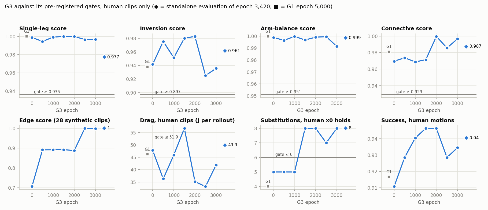
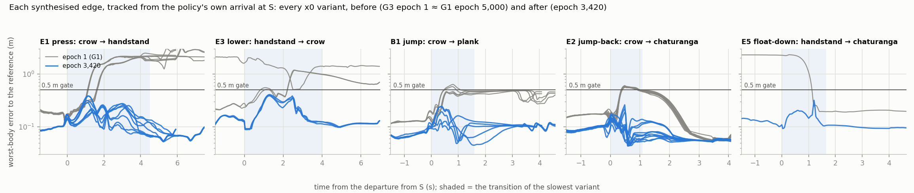
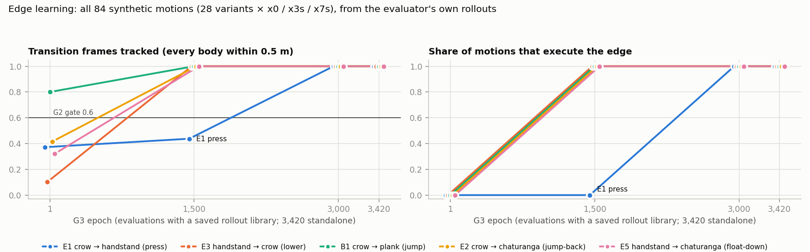
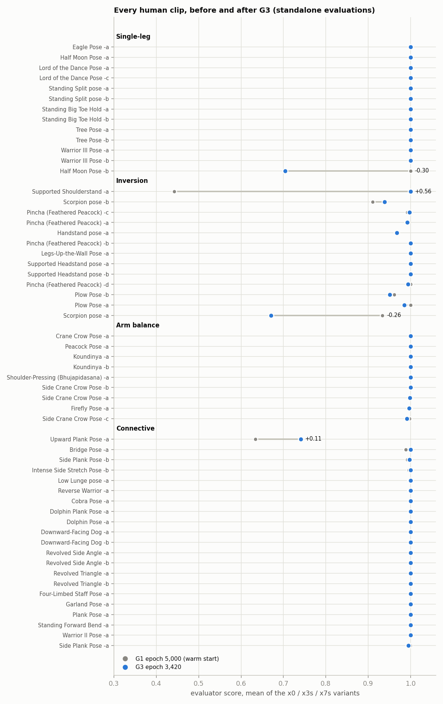

# G3, the graph fine-tune on release v3, stopped at epoch 3,420 and evaluated (2026-10-05)

Run `smpl_yogi_v2_expert56_g3_2f132f4299` (wandb `x1uz1cim`) is graph-growth Step 3 ([`../PLAN.MD`](../PLAN.MD), card
G3). It warm-starts G1's `epoch_5000.ckpt` (the AMP fine-tune, [`../g1_amp_eval/README.MD`](../g1_amp_eval/README.MD))
on the candidate release `holds_repaired_ftC_posefix.release_v3.2f132f4299`: release v2's 56 human clips plus 28
spliced synthetic clips of five new edges (E1 ×8, E3 ×3, B1 ×5, E2 ×11, E5 ×1; [`../r3_release/README.MD`](../r3_release/README.MD)).

**The user stopped it at epoch 3,420 of 6,000** (2026-10-05 06:42 PDT; the panel videos showed E1 learnt). It was killed
5 s after a `last.ckpt` write, so nothing was lost: `last.ckpt` holds epoch 3,420, and a copy is kept as
`results/smpl_yogi_v2_expert56_g3_2f132f4299/epoch_3420.ckpt` so that a resume cannot overwrite the analysed weights.
`score_based.ckpt` is epoch 3,000.

This folder evaluates epoch 3,420 against G1's epoch 5,000 (its warm start) with the instruments of the G1 and e15500
reviews, adds the edge instruments PLAN.MD's card R4b asked for, and renders every motion.

## 0. Bottom line

1. **All five new edges are learnt, from the policy's own arrival.** In the evaluator's rollouts (every motion from
   t = 0, so S is reached through the real human lead-in), **all 84 synthetic motions** (28 variants × x0/x3s/x7s)
   track their transition window on every frame (1.000), arrive at D within 0.02–0.05 m (6-body, best yaw) and hold
   D with its commanded supports down (by geometry 1.00; by load 1.00, E5 0.94–0.96). Before G3 (its epoch 1, G1's policy plus one
   update) **0 of 84** did (§3).
   - **E3, B1, E2 and E5 were learnt by epoch 1,500.** **E1, the press, came last**: 0.41–0.46 of its transition
     tracked at 1,500 (a foot comes back down), all 24 motions from about 2,500 (the evaluator's E1 `p_track` 0.60 at
     2,000, 1.00 at 2,500).
   - **G2's pre-registered 1,500-epoch gate would have dropped E1**, the edge that is now the cleanest. The decision
     was never taken (R4b's `edge_tracking.py` did not exist while G3 ran), and the run continued on the candidate. By
     the card's own rule the candidate is now the final v3: every variant passes at 3,000 and 3,420.
2. **The edges run on command, and the goal is causal at the hubs.** The panel commands each edge from a held S to
   163 replicas: **E1, E3, B1, E2 and E5 reach D on 163 of 163**, and the no-hijack control (same start, the S
   clip's own next hold commanded) also reaches its goal on 163 of 163 at all five hubs. Same state, different goal,
   different motion (§4).
   - **The training panels reported E2 and E5 at 0 of 186 throughout. That is a metric artefact, not the policy.**
     The panel's pose error normalises heading with the root's projected x axis, which is ill-conditioned at
     chaturanga's near-horizontal pelvis. At 3,420 the stock metric reads 0.39–0.40 m while every replica reaches the
     exact contact set; a rerun with a best-yaw pose error reads 0.034–0.037 m. On the evaluator's clip rollouts the
     stock metric even scores the reference against its own exemplar at 0.12–0.21 m (§4.1).
3. **From standing, the crow is now real, and it leads on into the new edges.** Commanded straight from her
   standing rest, G3 makes a **hands-only crow** (8 of 8 dumped replicas: both hands down, both feet up, pelvis
   0.72 m); G1's "crow" there was a one-foot forward fold. Standing → crow → handstand reaches a hands-only handstand
   on **94 %** of 163 replicas; standing → crow → plank and → chaturanga on 100 %. Standing → handstand directly still
   fails (0 %), as do the Pincha, headstand and side-plank forks. **The side-plank fork regressed:** 1.00 at panels
   500–2,000, 0.00–0.07 from 2,500 (§4.2).
4. **No forgetting on the human clips; one gate fails.** Over the last three evaluations (2,000 / 2,500 / 3,000),
   every group clears its floor: single-leg 0.998, inversion 0.948, arm balance 0.997, connective 0.994. Drag is
   **36.7 J** (gate ≤ 51.9 J; even under e15500's 39.6 J aim), jerk 61.0 and high-jerk frames 1.13 % (both pass),
   realisability no worse (float 1.8 % → 0.7 %), posture kept (7.2° joint angle to the human, G1 7.4°).
   **Substitutions fail: 7.7 against ≤ 6** (8 at 3,420; G1's epoch 5,000 has 4). They are holds G1 already flipped
   in and out of, not new kinds: Eagle -a's wrapped-foot kickstand ×2, Peacock -a's shank, and a second Koundinya -b
   hold (§2, §6).
5. **Clips: the same four below 0.95, with different members** (§5). 47 of 56 clips score 1.000 at both
   checkpoints.
   - **Fixed:** Supported Shoulderstand -a, 0.44 → 1.00. Its shoulderstand, lost under G1, is held again and the
     get-up works. It still dips once, to 0.37 at 3,000.
   - **Better:** Upward Plank -a, last three 0.37 → 0.90. It stands up at 2,000 and 3,000, not at 2,500 or 3,420.
   - **Worse at 3,420:** Half Moon -b (1.00 → 0.70, its x3s variant falls) and Scorpion -a (0.93 → 0.67). Both are
     single-checkpoint dips; G1 flipped Half Moon -b the same way.
6. **The executed edges are as fast as their references, and no faster.**
   - The quasi-static press (E1) peaks at 1.37–1.45× the human corpus's p99 body speed, its reference at 1.20–1.45×.
   - The momentum edges (B1, E2, E5) run 1.8–2.7× the p99, their references 1.7–3.1×.
   - The discriminator still scores the policy's motion on synthetic clips as less human than on human ones (AMP
     reward 0.29–0.31 against 0.55–0.57).
   - Per D1, no naturalness claim is made for the momentum edges.
7. **Deploy epoch 3,420 for the edges** (or 3,000, `score_based.ckpt`, which also holds every edge). Run R4b's
   funnel from the checkpoint's own S banks before G4. Fix the panel's pose metric (best yaw) before any further panel
   number is quoted for a prone or inverted goal (§8).

## 1. What was run, and what is evaluated

| | |
|---|---|
| Run | `smpl_yogi_v2_expert56_g3_2f132f4299`, wandb `x1uz1cim`, `data/scripts/run_expert_graph_ft.sh`, launched 2026-10-04 20:20 PDT, stopped 2026-10-05 06:42 PDT at epoch 3,420 of 6,000 (10.4 h; 10.4–11.2 s per epoch, against the timing run's 9.71 s) |
| Start | G1's `epoch_5000.ckpt` with its PPO and AMP state; the epoch-1 evaluation reproduces G1 on v3 (groups within 0.005) |
| Settings | PLAN.MD's G3 table: AMP w 0.5 from epoch 0 (×0.5 on `SYN_`, never demonstrations), anchoring arrival 0.4 / departure 0.2, package prior (each edge weighs three human clips), actor and critic normalisers frozen, support rule v2, no pushes |
| Policy evaluated | `epoch_3420.ckpt` (= `last.ckpt` at the stop) |
| Evaluations | the run's own at epochs 1, 500, …, 3,000 (CSV per motion; rollout libraries at 1, 1,500 and 3,000) and a **standalone evaluation of epoch 3,420** (`expert_revist/ft_c/eval_checkpoint.py`, the run's training config, 4,096 envs, 2,250 steps; its library carries ground forces). Rows labelled "3420s" use it |
| Panels | the run's six (500 … 3,000; 22 sequences at 186 replicas, stock pose metric) and three standalone panels at 3,420 (25 plans at 163 replicas: stock metric, best-yaw metric, best-yaw with 8 replicas' positions dumped) |
| Reference | G1's standalone evaluation of epoch 5,000 (`output/renderings/expert56_v2_amp_g1_e5000/eval_standalone_e5000/`) and its review |

**Read every corpus-wide `eval/*` scalar of this run with care.** From epoch 1 they pool the 84 synthetic motions with
the 168 human ones (`eval/success_rate`, `eval/perf/score`, `eval/drag/all_J`, `eval/normalized_jerk_mean`,
`eval/perf/substitution_holds_v2_x0`, and so `score_based.ckpt`). Every gate below is restated over the human
motions (`g3_gates.py`). The four human group scores never contain a `SYN_` clip.

## 2. The pre-registered gates, on human clips



The gates are PLAN.MD's G3 card, read over the last three evaluations (2,000 / 2,500 / 3,000). The floors are G1's
last-three means less 0.035. Jerk is recomputed per motion from the rollout libraries with the evaluator's own
`SmoothnessCalculator` kernel. It reproduces the logged all-motion value exactly at every library (116.5 / 61.0 /
59.2 / 54.2; G1 55.3), so the human-only restatement is the evaluator's number on fewer motions. Only epochs 1, 1,500,
3,000 and 3,420 have libraries.

| Gate | G1 epoch 5,000 | G3: 1 / 500 / 1,000 / 1,500 / 2,000 / 2,500 / 3,000 | 3,420 (standalone) | Last three | Verdict |
|---|---|---|---|---|---|
| Single-leg ≥ 0.936 | 1.000 | 0.999 / 0.995 / 0.999 / 1.000 / 1.000 / 0.997 / 0.997 | 0.977 | 0.998 | pass |
| Inversion ≥ 0.897 | 0.938 | 0.942 / 0.975 / 0.951 / 0.980 / 0.983 / 0.925 / 0.936 | 0.961 | 0.948 | pass |
| Arm balance ≥ 0.951 | 1.000 | 0.999 / 0.996 / 1.000 / 0.997 / 0.999 / 0.999 / 0.991 | 0.999 | 0.997 | pass |
| Connective ≥ 0.929 | 0.981 | 0.970 / 0.974 / 0.969 / 0.971 / 1.000 / 0.986 / 0.997 | 0.987 | 0.994 | pass |
| Drag, human ≤ 51.9 J | 46.2 | 47.8 / 36.3 / 45.9 / 56.7 / 35.2 / 33.2 / 41.9 | 49.9 | 36.7 | pass |
| Jerk, human < 72.2 | 55.3 | 57.0 / – / – / 56.5 / – / – / 61.0 | 59.3 | 61.0 | pass |
| High-jerk frames, human < 1.30 % | 0.79 | 0.87 / – / – / 0.86 / – / – / 1.13 | 0.98 | 1.13 | pass |
| Substitutions, human x0 holds ≤ 6 | 4 | 5 / 5 / 5 / 8 / 8 / 7 / 8 | 8 | 7.7 | **fail** |
| Success, human motions | 0.917 | 0.911 / 0.929 / 0.940 / 0.946 / 0.946 / 0.929 / 0.935 | 0.940 | 0.937 | (no gate) |
| Edge group (28 synthetic clips) | — | 0.706 / 0.891 / 0.892 / 0.892 / 0.888 / 1.000 / 0.998 | 1.000 | 0.962 | (§3) |

- **The 3,420 standalone dips on single-leg** (0.977) because one variant flips: Half Moon -b x3s scores 0.115. Every
  single-leg x0 clip is at 1.000 (§5).
- **What failed in each evaluation** (motions that left the 0.5 m gate). At 3,420: Half Moon -b x3s, Handstand -a
  ×3 (it falls in the last seconds of the clip, where the reference steps down), Scorpion -a ×3 and Upward Plank -a
  ×3. From epoch 500 to 2,000 every E1 motion also failed (ids 168–191); from 2,500 no synthetic motion fails.
- **Training kept improving to the stop** (500-epoch bins, `data/tb_training_binned.json`):
  - episode length 384 → 438 steps; terminations 5.1e-4 → 2.2e-4 per step;
  - `gt_rew` 0.952 → 0.959, `gr_rew` 0.757 → 0.783;
  - the critic's explained variance 0.97 → 0.95.
- **Health:**
  - the style/task advantage-std ratio sits at 0.23–0.26, in its band;
  - discriminator agent accuracy fell 0.93 → 0.90;
  - the effective sample size is 202–212 of 252;
  - the anchored starts drawn are 0.40 arrival / 0.20 departure / 0.08 t = 0 / 0.32 uniform, as configured.
  - The known-free load rose 1.07 → 1.51 N, matching the substitutions below.

## 3. The new edges, tracked from the policy's own arrival





`edge_tracking.py` scores every synthetic motion of a rollout library.
- **The transition window** is `[departure, arrival)`: the S hold's `t_end` to the D hold's `t_start`, read from the
  manifest (so the x3s/x7s shifts come for free) and cross-checked against R2's frame layout.
- **G2's gate** is ≥ 0.6 of those frames tracked (every body within 0.5 m).
- **"Reached D"** adds two conditions: D's 6-body error below 0.15 m on at least half of `[t_hold, t_end]`, and D's
  commanded supports down by geometry on ≥ 90 % of D's window.
- **Load** is the terrain-filtered vertical force, at ≥ 3 % body weight (E1's rule, 726 N body weight).

Ranges are over all of an edge's motions (variants × x0/x3s/x7s):

| Edge | Epoch | Motions reaching D | Transition tracked | Transition mean / peak body error (m) | D error (m) | D supports, geometry / load |
|---|---|---|---|---|---|---|
| **E1** press, crow → handstand (8 variants, T 2.95–4.5 s) | 1 | 0 / 24 | 0.35–0.39 | 0.32–0.47 / 2.06–2.20 | 0.47–0.89 | 0.15–1.00 / 0.11–1.00 |
| | 1,500 | 0 / 24 | 0.41–0.46 | 0.27–0.37 / 1.69–1.72 | 0.53–0.54 | 1.00 / 1.00 |
| | 3,000 | **24 / 24** | 1.00 | 0.08–0.09 / 0.33–0.41 | 0.03 | 1.00 / 1.00 |
| | 3,420 | **24 / 24** | 1.00 | 0.06–0.07 / 0.24–0.39 | 0.03 | 1.00 / 1.00 |
| **E3** lower, handstand → crow (3, T 4 s) | 1 | 0 / 9 | 0.00–0.50 | 0.28–1.27 / 1.17–2.41 | 0.35–0.80 | 0.00–1.00 / 0.00–1.00 |
| | 1,500 | **9 / 9** | 1.00 | 0.10–0.11 / 0.44–0.47 | 0.07 | 1.00 / 1.00 |
| | 3,420 | **9 / 9** | 1.00 | 0.07–0.08 / 0.38–0.41 | 0.05 | 1.00 / 1.00 |
| **B1** jump, crow → plank (5, T 1.08–1.6 s) | 1 | 0 / 15 | 0.39–1.00 | 0.21–0.23 / 0.46–0.64 | 0.26–0.34 | 0.52–0.74 / 0.43–0.68 |
| | 1,500 | **15 / 15** | 1.00 | 0.05–0.07 / 0.12–0.26 | 0.04–0.05 | 1.00 / 1.00 |
| | 3,420 | **15 / 15** | 1.00 | 0.04–0.07 / 0.14–0.25 | 0.04 | 1.00 / 1.00 |
| **E2** jump-back, crow → chaturanga (11, T 1.08 s) | 1 | 0 / 33 | 0.27–0.52 | 0.26–0.31 / 0.56–0.66 | 0.03–0.18 | 0.00–0.81 / 0.00–0.71 |
| | 1,500 | **33 / 33** | 1.00 | 0.04–0.06 / 0.13–0.28 | 0.02–0.03 | 1.00 / 0.97–1.00 |
| | 3,420 | **33 / 33** | 1.00 | 0.04–0.06 / 0.13–0.28 | 0.02 | 1.00 / 1.00 |
| **E5** float-down, handstand → chaturanga (1, T 1.65 s) | 1 | 0 / 3 | 0.32 | 0.49–0.52 / 2.31 | 0.05 | 1.00 / 0.80–1.00 |
| | 1,500 | **3 / 3** | 1.00 | 0.07 / 0.24 | 0.03–0.04 | 1.00 / 0.91–0.97 |
| | 3,420 | **3 / 3** | 1.00 | 0.07–0.08 / 0.27–0.32 | 0.03 | 1.00 / 0.94–0.96 |

**What each edge did before G3** (epoch 1; the grey traces in the first figure):
- **E1:** pressed up and then put a foot back down 1.1–1.7 s into the press. The feet carry load on 41–66 % of the
  transition, and the clip ends far from the handstand (0.47–0.89 m).
- **E3:** came down from the handstand onto its head, not into crow: the head is loaded through D's window, the
  pelvis and right upper arm on the floor in one variant.
- **B1:** jumped and landed, but not in the plank pose (0.26–0.34 m at D). D's supports were down on only half to
  three-quarters of the window.
- **E2:** lost the reference 0.38–0.42 s into the jump (peak 0.6 m), then caught up into chaturanga during the
  lead-out. That is why D's error was already small, while D's supports were not.
- **E5:** had already fallen out of the handstand before departing: lead-in tracked 0.23, the error 2.3 m at the
  departure.

**What it does now.**
- **Planted hands stay planted through E1 and E3:** only the hands carry load during the transition.
- **The landings put the feet down on time:** B1 and E2 load the feet over the last 46–65 % of the transition window,
  E5 over the last 22–24 %, which is the landing phase itself.
- **The lead-outs track to the end of every synthetic clip** (1.00; E1's was 0.93 at 3,000: the handstand's
  step-down, which Handstand -a itself still misses).

**Speed and jerk of the executed transitions.**
- Measured over `[departure, arrival + 0.5 s]` at 30 Hz, as a multiple of the per-body p99 of the human x0
  references, on the same rollouts.
- These clips cannot meet the corpus p99 by construction (the corpus has no jumps); D1 made naturalness advisory for
  them.

| Edge | Peak speed ÷ p99: policy (reference) | Peak jerk ÷ p99: policy (reference) |
|---|---|---|
| E1 press | 1.37–1.45 (1.20–1.45), right knee | 0.87–1.38 (0.46–0.93) |
| E3 lower | 1.94–1.96 (1.61–1.86), left hip | 4.3–8.4 (2.7–4.2) |
| B1 jump | 1.77–1.81 (1.68–2.13), right knee | 5.1–6.5 (3.8–6.6) |
| E2 jump-back | 2.46–2.54 (2.57–2.88), right knee | 5.7–11.2 (6.9–13.5) |
| E5 float-down | 2.74 (3.13), left hip | 9.7 (14.5) |

**The policy moves at its references' speed.**
- Its peak jerk is below the reference's on E2 and E5, and close to it on B1 (the ankles at the landing, as in the
  reference).
- It is about 1.5–2× the reference's on E1 and E3. The peak sits at the left toe or hip, the free legs, not at the
  planted hands.
- The references were optimised in the same PhysX, by MPPI, and are not smooth either.

## 4. On command: the panel

The panel commands each plan to every replica of its sequence (`run_sequence_panel.py`). Plans `edge_<E>` start in
the spliced clip at S's `t_hold`, hold S for 3 s, then command D with the reach `T + 0.5 s` and hold it for 3 s.
`nohijack_<E>` starts the same way and commands the S clip's own next hold. `fork_edge_<E>` starts at the S clip's
t = 0 (her standing rest) and commands S, then D. Hold rates are shares of replicas within 0.15 m over the goal's
hold window (`panel_compare.py`, `data/panel.json`).

### 4.1 The edges, and the metric that hid two of them

| Goal (plan) | G3 panels 500 / 1,000 / 1,500 / 2,000 / 2,500 / 3,000 (stock) | 3,420 stock | 3,420 best yaw |
|---|---|---|---|
| E1: D = handstand (`edge_E1`) | 0.00 / 0.00 / 0.00 / 0.00 / **1.00 / 1.00** | 1.00 | **1.00** (0.068 m) |
| E3: D = crow (`edge_E3`) | 1.00 at every panel | 1.00 | **1.00** (0.036 m) |
| B1: D = plank (`edge_B1`) | 1.00 at every panel | 1.00 | **1.00** (0.057 m) |
| E2: D = chaturanga (`edge_E2`) | 0.00 at every panel (0.36–0.45 m, contact IoU 1.00) | 0.00 (0.39 m) | **1.00** (0.034 m) |
| E5: D = chaturanga (`edge_E5`) | 0.00 at every panel (0.37–0.48 m, contact IoU 1.00) | 0.00 (0.40 m) | **1.00** (0.037 m) |
| no-hijack, crow hubs (`nohijack_E1/E2/B1`) → standing | 1.00, 1.00, 1.00, 0.91–0.93, 0.98–0.99, 1.00 | 1.00 | 1.00 |
| no-hijack, handstand hubs (`nohijack_E3/E5`) → Handstand -a @1632 | 1.00 at every panel | 1.00 | 1.00 |

**Why the stock panel failed E2 and E5.**
- `SequenceVizRunner._goal_pose_errors` puts both poses into each one's own heading frame, `calc_heading_quat_inv`:
  the root's x axis projected on the floor. That chart is ill-conditioned when the pelvis is near horizontal (6.1 % of
  corpus frames; `heading_chart_audit.py`), and chaturanga is such a pose.
- Measured on the evaluator's own clip rollouts at epoch 3,000, over D's window:

  | Destination | Policy, heading chart | Policy, best yaw | Reference vs its own exemplar, heading chart |
  |---|---|---|---|
  | chaturanga (E2) | 0.404 m | 0.032 m | 0.208 m |
  | chaturanga (E5) | 0.398 m | 0.030 m | 0.121 m |
  | plank (B1) | 0.099 m | 0.041 m | 0.038 m |
  | handstand (E1) | 0.038 m | 0.034 m | 0.022 m |
  | crow (E3) | 0.066 m | 0.054 m | 0.028 m |

  The chaturanga goal's chart heading reads 41–43° where the policy's reads about 0°.
- At 3,420 the stock-metric panel reads 0 of 163 at 0.39–0.40 m while 163 of 163 reach the exact contact set. A
  second panel run (fresh rollouts) with the best-yaw metric reads 163 of 163 at 0.034–0.037 m.
- `run_panel_bestyaw.py` is the stock runner with that one function replaced by `best_yaw_dist`'s closed form on the
  same bodies.

**The causality pair** is the card's "goal is causal at the hubs" test, from the same start state: commanding D
reaches D, commanding S's own continuation reaches that. It passes at all five hubs (both ≥ 0.6; here 1.00 and 1.00).
The start is the spliced clip's S state (a reference state) rather than G3's own arrival banks. R4b's funnel from the
checkpoint's own banks is still unbuilt.

### 4.2 Forks from standing, with what the replicas stand on

Pose and contact IoU cannot tell a crow from a forward fold: the crow goal reads IoU about 0.2 even when the panel
starts in a real crow, because its body-body braces are under-reported. So the third standalone run dumped 8
replicas per plan, and `panel_supports.py` reads which zones are down (a body origin below 8 cm) over each goal's
hold window (`data/panel_supports_e3420.json`).

| Plan → goal | G1 epoch 5,000 | G3 panels 500 … 3,000 | 3,420 (best yaw) | What the 8 dumped replicas stand on at 3,420 |
|---|---|---|---|---|
| Crow (`fork_Crane_Crow`) | 1.00, a one-foot forward fold (IoU 0.23) | 1.00 at every panel | 1.00 (0.035 m) | **hands only, feet up, pelvis 0.72 m: a real crow, 8 of 8** |
| crow → handstand (`fork_edge_E1`) | — | not in the training panel | **0.94** (0.079 m) | crow 8/8, then **hands-only handstand 8/8**, pelvis 1.05 m |
| crow → plank (`fork_edge_B1`) | — | — | 1.00 / 1.00 | crow 8/8, plank 8/8 (pelvis 0.46 m) |
| crow → chaturanga (`fork_edge_E2`) | — | — | 1.00 / 1.00 | crow 8/8, chaturanga 8/8 (pelvis 0.26 m) |
| handstand → crow (`fork_edge_E3`) | — | — | 0.00 / 0.02 | on the floor (pelvis 0.09 m); never inverts |
| handstand → chaturanga (`fork_edge_E5`) | — | — | 0.01 / **0.65** | never inverts (the feet stay down); ends in chaturanga anyway (8/8 by support, 0.21 m) |
| Handstand (`fork_Handstand`) | 0.00 | 0.00 at every panel | 0.00 | on the floor (pelvis 0.10 m) |
| Pincha (`fork_Feathered_Peacock`) | 0.00 | 0.00 at every panel | 0.00 | hands down, pelvis 0.09 m |
| Supported Headstand | 0.02 (1.00 at G1's 1,500) | 0.00 / 0.47 / 0.00 / 0.00 / **0.99** / 0.00 | 0.00 | a fold on the feet and one hand |
| Side Plank | 1.00 | 1.00 / 1.00 / 1.00 / 1.00 / **0.07 / 0.02** | 0.00 | both hands and one foot down, pelvis 0.39 m: not a side plank |
| Tree | 1.00 | 1.00 / 0.00 / 0.00 / 1.00 / 0.00 / 1.00 | 0.06 | falls to hands and a foot |
| Warrior II, Downward Dog, dwell Warrior II 3 s / 10 s | 1.00 | 1.00 at every panel | 1.00 | correct supports, 8 of 8 |

- **The crow from standing is the first hard pose reached from standing reliably and with the right support.** The
  synthetic clips put most of the graph's dwell on crow (505.8 s, against 21.5 s in v2; R3), and crow now works as a
  hub: commanded from standing, the policy reaches it and continues into any of its three new edges.
- **The handstand is reachable from standing only through crow.** The direct handstand fork stays at 0; so do the
  forks that need a handstand first (E3, E5). E5's fork reaches chaturanga anyway, through another route (0.65).
- **The headstand fork flips as it did under G1** (0.99 at 2,500, 0 at 3,000 and 3,420). The side-plank fork's loss
  from 2,500 is new; the side-plank clips themselves still score 0.995–0.997 (§5).

## 5. Clips



Each clip's score is the mean over its x0/x3s/x7s variants (`per_clip.py`, `data/per_clip.json`).
- **Clips below 0.95:** 4 at G1's epoch 5,000 (Upward Plank -a, both Scorpions, Shoulderstand -a) and 4 at G3's
  3,420 (Upward Plank -a, both Scorpions, Half Moon -b).
- **Clips that change by more than 0.2 between consecutive evaluations (500 … 3,000, 3,420):** 5 of 56. G1 had 7 of
  56 over its ten evaluations, e15500 13.

| Clip | G1 last three / 5,000 | G3: 1 / 500 / 1,000 / 1,500 / 2,000 / 2,500 / 3,000 / 3,420s | G3 last three | What changed |
|---|---|---|---|---|
| Supported Shoulderstand -a | 0.49 / 0.44 | 0.51 / 0.99 / 0.83 / 1.00 / 1.00 / 1.00 / 0.37 / 1.00 | 0.79 | **fixed from epoch 500**: the shoulderstand forms again and the get-up works; one dip at 3,000 |
| Upward Plank -a | 0.37 / 0.63 | 0.38 / 0.50 / 0.40 / 0.42 / 1.00 / 0.70 / 1.00 / 0.74 | 0.90 | **the exit now works at some checkpoints** (2,000 and 3,000), not at 3,420 |
| Half Moon -b | 0.62 / 1.00 | 1.00 / 1.00 / 1.00 / 1.00 / 1.00 / 0.96 / 0.96 / 0.70 | 0.97 | flips at 3,420: its x3s variant falls (0.115); the evaluator's x0 leaves the gate briefly at 6.8 s and recovers, and **in the render (a fresh rollout) the x0 falls at about 7 s**; so at 3,420 the clip is unreliable, not just unlucky. It flipped under G1 too |
| Scorpion -a | 0.94 / 0.93 | 0.94 / 0.95 / 0.70 / 0.91 / 0.94 / 0.93 / 0.95 / 0.67 | 0.94 | flips at 1,000 and 3,420: the evaluator's x0 leaves the gate at 8.2 s and tracks 0.33; **the render (a fresh rollout) leaves it at the same moment and recovers, tracking 0.81**, so the 3,420 score is partly the draw |
| Pincha -a | 0.99 / 0.99 | 0.99 / 1.00 / 0.99 / 0.99 / 0.99 / 0.21 / 1.00 / 0.99 | 0.73 | one dip at 2,500 |
| Scorpion -b | 0.81 / 0.91 | 0.91 / 0.83 / 0.95 / 0.96 / 0.91 / 0.95 / 0.95 / 0.94 | 0.94 | the hands-only scorpion G1 found is kept |
| Handstand -a | 0.97 / 0.97 | 0.96–0.97 at every evaluation | 0.97 | unchanged: holds both handstands, still never steps down at the end |
| Plow -b | 0.93 / 0.96 | 0.93 / 0.97 / 0.97 / 0.94 / 1.00 / 0.97 / 0.93 / 0.95 | 0.97 | the get-up G1 learnt is kept |

## 6. Supports, substitutions, realisability, drag, posture

**Per hold** (`analyze_rollouts_v2.py` on release v3, x0 clips; 270 human holds, 112 synthetic):

| Library | Tracked ≥ 90 % | Commanded supports down ≥ 90 % (of tracked) | 6-body < 0.15 m | Substitutions (geometry) | Preparation holds realised |
|---|---|---|---|---|---|
| G1 5,000 (standalone) | 264 (98 %) | 236 (89 %) | 248 (94 %) | 10 | 22 / 30 |
| G3 1 | 263 (97 %) | 237 (90 %) | 247 (94 %) | 8 | 22 / 30 |
| G3 1,500 | 261 (97 %) | 242 (93 %) | 246 (94 %) | 8 | 19 / 29 |
| G3 3,000 | 267 (99 %) | 241 (90 %) | 251 (94 %) | 8 | 19 / 30 |
| **G3 3,420 (standalone)** | 264 (98 %) | **246 (93 %)** | 248 (94 %) | 9 | 20 / 29 |
| G3 3,420, the 112 synthetic holds | 112 (100 %) | 112 (100 %) | all scored ones | 0 | — |

(32 of the synthetic holds have no scorable pose window: the crow lead-in's first hold has `t_hold = t_end`, and the
final standing holds run past the recorded frames.)

**Substitutions by load** (E1's force rule, human x0 holds, every evaluation; the CSV's `substitutions_v2`):

| Epoch | n | Holds |
|---|---|---|
| G1 5,000 (standalone) | 4 | Peacock -a head @13.1; Koundinya -b left foot @17.7; Side Crow -a right foot @14.5; Side Plank -a left foot @14.7 |
| G3 1 | 5 | the same four + Koundinya -b right foot @12.9 |
| G3 1,000 | 5 | Eagle -a wrapped foot @11.7, @13.3; Peacock head; Koundinya -b @12.9; Side Crow -a |
| G3 2,000 | 8 | Eagle ×2; Peacock head and shanks @10.3; Koundinya -b @12.9; Downward Dog -a left hand @9.9; Side Plank -a; Bridge -a right hand @14.1 |
| G3 3,000 | 8 | Eagle ×2; Peacock head; Koundinya -b ×2; Bhujapidasana left foot @9.05; Side Crow -a; Side Plank -a |
| G3 3,420 (standalone) | 8 | Eagle ×2; Peacock head and left shank; Koundinya -b ×2; Side Crow -a; Side Plank -a |

- **Every hold on the 3,420 list was flagged at some G1 evaluation;** the count moved, not the kind. (Bhujapidasana
  at 3,000 and Downward Dog -a's hand at 2,000 are the two holds G1 never had under the load rule.)
  - Eagle -a's wrapped foot carried load at most G1 evaluations from 500 to 4,500, though not at 5,000.
  - Peacock -a's head has been flagged at every evaluation since e15500's epoch 9,500.
- The known-free load the support term prices rose 1.07 → 1.51 N over the run.
- Nothing in G3's recipe targets substitutions. The term's weight (−0.3) and E1's curriculum rule are G1's.

**Knees in the kneeling holds** (both shanks commanded down; 12 tracked holds):

| Library | Left knee down | Right knee down |
|---|---|---|
| G1 5,000 | 11 / 12 | 11 / 12 |
| G3 1,500 | 12 / 12 | 12 / 12 |
| G3 3,000 | 9 / 12 | 11 / 12 |
| G3 3,420 | 11 / 12 | **6 / 12** |

At 3,420 the right knee hovers in Pincha's three kneeling preparations and the supported headstand's two kneeling
variants. At 3,000 those knees were down. This is G1's left-knee flip mirrored, and it is a checkpoint property, not
a trend.

**Realisability** (`reference_curation.realisability_v2` on the human motions, scored under release v2, whose 168
motions are v3's byte for byte; `realisability_human.py`):

| Library | Tracked per motion | Slide p50 / p90 (cm/s) | Float (commanded supports > 2 cm) | COM–COP p50 / p90 (cm) |
|---|---|---|---|---|
| G1 5,000 | 0.973 | 0.10 / 0.99 | 1.8 % | 3.23 / 6.83 |
| G3 1 | 0.968 | 0.10 / 0.99 | 1.8 % | 3.17 / 6.70 |
| G3 1,500 | 0.981 | 0.11 / 1.19 | 0.6 % | 3.18 / 6.81 |
| G3 3,000 | 0.977 | 0.11 / 0.96 | 1.1 % | 3.56 / 6.94 |
| **G3 3,420** | 0.979 | 0.11 / 1.04 | **0.7 %** | 3.30 / 7.09 |

**Drag** (`drag_locate.py`: G1's frame-by-frame kernel on G3's libraries, matching the evaluator's CSV).
- **G1's signature habit is mostly gone.** Back upright after a plank-family pose, G1 closed a too-wide stance by
  sliding a loaded foot. The same stand-up events, G1 epoch 4,500 → G3 3,420 (x0 rollouts):

  | Clip | G1's stand-up event | G3's | Clip total, G1 5,000 → G3 3,420 |
  |---|---|---|---|
  | Side Plank -a | 114 J (19.7–20.8 s) | 7.7 J (20.1–20.4 s) | 95 → 125 J: now the right hand slides inside the side plank (below) |
  | Side Plank -b | 104 J (21.4–22.5 s) | 3.9 J | 51 → 9 J |
  | Plank -a | 77 J (13.3–14.1 s) | 8.8 J | 55 → 32 J |
  | Downward Dog -a | 41 J (11.2–11.6 s) | 16.1 J (stance 0.16 → 0.14 m) | 28 → 29 J |

  The habit survives at full size in one place: Bhujapidasana's stand-up, 46 J, closing the stance 0.36 → 0.24 m.
- **New is hand slip under load inside holds:**
  - Side Plank -a's right hand slides through the side plank (94 J at 10.6–16.8 s);
  - Koundinya -b's right hand slides in its wide hands-only variant hold (61 J).
- **The rest is the flipping clips:**
  - Scorpion -a, 150 J, the feet during the scorpion hold;
  - Upward Plank -a, 114 J.

**Posture** (G1's `style_shift.py` on the human motions). The joint angle to the human:

| Library | Median joint angle | Systematic bias |
|---|---|---|
| G1 5,000 | 7.4° | 1.2° |
| G3 1,500 | 7.48° | 1.49° |
| G3 3,000 | 7.41° | 1.39° |
| G3 3,420 | 7.19° | 1.17° |

AMP's posture gain survives the fine-tune. Holds stay stiller than the human: body speed rms 0.081 m/s in the hold
windows, against the reference's 0.111.

## 7. The videos

**Setup.**
- `render_review.py` runs `data/scripts/render_policy_videos.py` on `epoch_3420.ckpt`: the run's frozen inference
  config, one env, every clip from t = 0 for its full length, deterministic actions, no termination
  (`--fail-threshold 0`).
- Two changes from the e15500 and G1 reviews:
  - **the green ghost is the reference clip at the current clip time**, posed with the same spawn offset the
    tracking error uses and shown 1.8 m to the right; the commanded-hold sphere markers are hidden. Grey vs green is
    therefore "policy vs what it tracks", frame for frame. In earlier reviews the ghost showed the commanded hold,
    seconds ahead;
  - **a closer, level tracking shot:** 4.5 m away, looking at the midpoint between the two figures at 1.0 m height,
    framing −0.5 to 2.4 m, so a handstand's feet stay in frame.
- 1280×720, 30 fps, real time. Video time t is clip time t + 0.1 s; the caption shows clip time.
- `compose_videos.py` captions each render and assembles the deliverables. Each caption gives:
  - human clips: the clip and its group, the evaluator's score at G3 3,420 and at G1 5,000, and **this rollout's**
    tracked share and mean body error (the rendered rollout's own, from `render_compare.py`);
  - synthetic clips: the edge and variant, T, the evaluator's transition metrics at 3,420, what the edge did before
    G3, and a phase banner from the clip's lineage: human lead-in, S held, **synthesised transition** (orange), hold
    at D, human lead-out;
  - the clip time (top right) and which figure is which (bottom left).

**Do the renders show what the evaluator measured?** On 80 of the 84 motions the rendered rollout reproduces the
evaluator's own epoch-3,420 rollout to within 5 mm of mean body error (median 0.6 mm; `render_compare.py`,
`data/render_compare.json`), **all 28 synthetic clips among them**, so the edge videos show the measured behaviour.
The divergent four are clips whose outcome depends on the simulation itself:
- **Half Moon -b:** the render falls at about 6.4 s (tracked 0.26), where the evaluator's x0 recovers (0.99).
- **Scorpion -a:** the reverse. The render recovers (0.81), where the evaluator's x0 fell (0.33).
- **Side Crow -a and Upward Plank -a:** 9–11 mm apart, the same behaviour.

**Where** (`output/renderings/expert56_v2_g3_e3420/`, not in git):

| File | What |
|---|---|
| `G3_e3420_new_edges.mp4` (1 min 38 s) | **The new edges, one video.** Per edge: a title card (with what it did before G3), the edge's showcase variant (R4a's plan clip) from 3 s before departure to 4 s after arrival, then all its variants in a grid, synchronised at departure |
| `G3_e3420_new_edges_all_variants.mp4` (8 min 19 s) | all 28 synthetic clips in full, edge by edge, captioned |
| `G3_e3420_human_single_leg.mp4` (4 min 34 s), `_inversion.mp4` (7 min 30 s), `_arm_balance.mp4` (3 min 53 s), `_connective.mp4` (6 min 46 s) | the 56 human clips in full, by group, each group after a title card |
| `human/H<NN>_<group>_<clip>.mp4`, `edges/<edge>_<variant>.mp4` | the same, one file per clip |
| `timelines/<stem>_timeline.png` | **all 84 x0 motions from the evaluator's own epoch-3,420 rollouts** (`analyze_rollouts_v2.py --plots`): tracking error, 6-body distance to the commanded hold and to the reference, pelvis and head heights against the reference, and which zones are down, policy against reference, with every hold window shaded |
| `part_a/`, `part_b/` | the raw renders with their `.motion` recordings, contact sheets and render timelines (`analyze_rollouts_v2.py --render-dir`) |

**Where to look** (file under `human/` or `edges/`; clip times):

| What | Where |
|---|---|
| The press from the policy's own crow, every variant | `G3_e3420_new_edges.mp4` 0:04–0:28 (E3 0:28–0:51, B1 0:51–1:09); `edges/E1_press_*` from 5.9 s (transition 4.5 s or 2.95 s) |
| The jump-back and float-down landing in chaturanga (the edges the training panel scored 0) | `G3_e3420_new_edges.mp4` 1:09–1:26 (E2) and 1:26–1:38 (E5); `edges/E2_jumpback_*` 5.9–7.0 s; `edges/E5_floatdown_mid_s0_t6rpx12` 9.0–10.7 s |
| The fixed exit: a straight shoulderstand, then standing | `human/H26_inversion_Supported_Shoulderstand_pose_-a.mp4` 9–16 s (the shoulderstand), standing by about 25 s |
| A fall in this rollout that the evaluator's x0 rollout did not have | `human/H03_single_leg_Half_Moon_Pose_-b.mp4` from 6.4 s |
| The unreliable exit, failing here | `human/H54_connective_Upward_Plank_Pose_-a.mp4` from 24 s: lies back flat while the reference sits up and stands |
| Holds both handstands, still never steps down | `human/H18_inversion_Handstand_pose_-a.mp4` 45–48.9 s |
| The substitutions that remain | `human/H01_single_leg_Eagle_Pose_-a.mp4` 7–15 s (the wrapped right foot on the floor); `human/H51_connective_Side_Plank_Pose_-a.mp4` 10.6–16.8 s (top foot down, the right hand sliding) |

## 8. What this means, and what to do next

1. **Step 3's edge phase has its result: the expert learnt all five synthesised edges, and executes them on command
   from a held source pose.** The paper's "new edges" claim needs at least three; it has five.
   - Per PLAN.MD's acceptance the candidate release becomes the final v3 with no drops.
   - **Write it as five edges learnt in fine-tuning, and on command, at 1.00, from a reference S state.** R4b's
     funnel from G3's own banks is still owed. The X0 falsifier (S0) has not run.
2. **The quasi-static press needed about 2,500 epochs; the dynamic edges 1,500 or fewer.** G2's 1,500-epoch gate
   was set too early for slow, strength-limited edges. If edges are added again, gate at about 3,000 epochs, or per
   edge kind.
3. **Retire the stock panel pose metric for prone and inverted goals.** It reported two learnt edges as 0 for the
   whole run. `run_panel_bestyaw.py` shows the fix (best yaw on the same bodies). Per the panel's own docstring, the
   live diagnostic `ContactGraphControl._goal_pose_error` and `score_probe_pose.py` use the same chart. Fix it
   before G4, default-off, as for any change to the expert's code.
4. **Substitutions are the open gate.** The count (7.7 against ≤ 6) is the flip set G1 already had: Eagle's
   kickstand and Peacock's head. If G4's pushes go ahead, PLAN.MD §1.4's outrigger insurance applies directly: the
   hands-only guard, and v2 substitutions no more than G3's 8.
5. **The side-plank fork's loss (from epoch 2,500) is the one new goal-conditioning regression.** The clip itself
   still scores 0.995. Check it with the panel at 2,000 against 3,420 before G4, from S0's fork battery.
6. **Deployment:** epoch 3,420 (or 3,000) for the edges. For a hard-pose fork from standing, the crow is now a
   working hub; the handstand is reachable through it (standing → crow → handstand 0.94), not directly.

## 9. Reproduce

The CPU steps take seconds to minutes. The evaluation and panels need the GPU, the renders also a display, and at
most two IsaacLab processes may run at once. Start two renderers together: a renderer that is already recording when
another IsaacLab process starts hangs silently (it happened here, see the memory note `isaaclab-render-concurrency`).

```bash
RUN=results/smpl_yogi_v2_expert56_g3_2f132f4299; D=expert_revist/graph_growth_2026_10_03/g3
OUT=output/renderings/expert56_v2_g3_e3420; PY=../env_isaaclab/bin/python
cpu() { CUDA_VISIBLE_DEVICES='' PYTHONPATH=.:data/scripts nice -n 19 taskset -c 16-23 "$@"; }
# 1. the standalone evaluation of epoch 3,420 (headless, the run's training config)
PYTHONPATH=. $PY expert_revist/ft_c/eval_checkpoint.py --checkpoint $RUN/epoch_3420.ckpt --config $RUN/resolved_configs.pt \
    --out-dir $OUT/eval_standalone_e3420
LIB=$OUT/eval_standalone_e3420/results/predicted_motion_lib_epoch_0.pt
# 2. gates (TensorBoard dump first), edges, holds, clips, realisability, drag, posture
$PY expert_revist/run1_gap_analysis/dump_tb_scalars.py $RUN/lightning_logs/version_0/events.out.tfevents.* $OUT/tb_scalars.json
cpu $PY $D/g3_gates.py
cpu $PY $D/edge_tracking.py --library e1=$RUN/results/predicted_motion_lib_epoch_1.pt \
    --library e1500=$RUN/results/predicted_motion_lib_epoch_1500.pt --library e3000=$RUN/results/predicted_motion_lib_epoch_3000.pt \
    --library e3420=$LIB --out $D/data/edge_tracking.json
for e in 1 1500 3000; do cpu $PY expert_revist/expert56_v2_e15500/analyze_rollouts_v2.py --library $RUN/results/predicted_motion_lib_epoch_$e.pt \
    --release holds_repaired_ftC_posefix.release_v3.2f132f4299 --out $D/data/library_g3_e$e.json --summary; done
cpu $PY expert_revist/expert56_v2_e15500/analyze_rollouts_v2.py --library $LIB --release holds_repaired_ftC_posefix.release_v3.2f132f4299 \
    --out $D/data/library_g3_e3420.json --summary
cpu $PY $D/per_clip.py
OMP_NUM_THREADS=1 cpu $PY $D/realisability_human.py --library $LIB --out $D/data/realisability/g3_e3420.json   # and 1 / 1500 / 3000
cpu $PY $D/drag_locate.py
# posture: G1's style_shift.py on human-only copies of the libraries (it looks every stem up in release v2)
# 3. panels at 3,420: stock metric, best yaw, best yaw with 8 replicas' positions dumped; then supports and the collation
for M in heading best_yaw; do PYTHONPATH=. $PY $D/run_panel_bestyaw.py --metric $M --checkpoint $RUN/epoch_3420.ckpt --num-envs 4096 \
    --no-video --out-dir $OUT/panel_e3420_$( [ $M = heading ] && echo heading || echo bestyaw ) --plans $(cat $OUT/panel_plans.txt); done
PYTHONPATH=. $PY $D/run_panel_bestyaw.py --metric best_yaw --dump-positions 8 --checkpoint $RUN/epoch_3420.ckpt --num-envs 4096 \
    --no-video --out-dir $OUT/panel_e3420_bestyaw_dump --plans $(cat $OUT/panel_plans.txt)
cpu $PY $D/panel_supports.py $OUT/panel_e3420_bestyaw_dump/positions.npz
$PY $D/panel_compare.py
# 4. figures; renders (two together, one display); captions and compilations
$PY $D/plot_figures.py
for P in a b; do DISPLAY=:0 PYTHONPATH=. $PY $D/render_review.py --checkpoint $RUN/epoch_3420.ckpt --simulator isaaclab \
    --motion-ids $(python3 -c "import json;print(' '.join(map(str,json.load(open('$OUT/render_split.json'))['${P^^}'])))") \
    --fail-threshold 0 --min-seconds 0 --skip-existing --overrides env.ref_respawn_offset=0.005 simulator.ghost_robot=True \
    --out-dir $OUT/part_$P > $OUT/part_$P.log 2>&1 & done; wait
for P in a b; do cpu $PY expert_revist/expert56_v2_e15500/analyze_rollouts_v2.py --render-dir $OUT/part_$P \
    --release holds_repaired_ftC_posefix.release_v3.2f132f4299; done
cpu $PY expert_revist/expert56_v2_e15500/analyze_rollouts_v2.py --library $LIB --release holds_repaired_ftC_posefix.release_v3.2f132f4299 \
    --out $OUT/timelines/library_e3420.json --plots $OUT/timelines        # the 84 evaluator timelines
$PY $D/render_compare.py                       # each render against the evaluator's rollout (captions read it)
$PY $D/compose_videos.py
$PY $D/appendix_tables.py                      # §11
```

## 10. Files

In this folder (tracked):

| Path | What |
|---|---|
| `g3_gates.py` | §2: the gates on human clips at every evaluation, jerk recomputed per motion from the libraries → `data/gates.json`, `data/tb_eval_scalars.json`, `data/tb_training_binned.json` |
| `edge_tracking.py` | §3 (PLAN.MD's R4b script): per synthetic motion, the transition window, arrival at D, supports by geometry and load, transition contacts, speed and jerk → `data/edge_tracking.json` |
| `per_clip.py` | §5 → `data/per_clip.json` |
| `run_panel_bestyaw.py`, `panel_supports.py`, `panel_compare.py` | §4: the stock panel with a best-yaw pose metric and a position dump; supports per goal; the collation → `data/panel_supports_e3420.json`, `data/panel.json` |
| `realisability_human.py`, `drag_locate.py` | §6 → `data/realisability/`, `data/drag_locate.json`; `data/library_g3_e*.json` are `analyze_rollouts_v2.py` on release v3; `data/style_shift.json` is G1's `style_shift.py` |
| `render_review.py`, `render_compare.py`, `compose_videos.py` | §7: the renderer with the reference ghost and the closer camera; each render against the evaluator's rollout (`data/render_compare.json`); captions and compilations |
| `plot_figures.py`, `figures/` | the four figures |
| `appendix_tables.py` | §11's two tables, from `data/per_clip.json` and `data/edge_tracking.json` |

Elsewhere (not in git):

| Path | What |
|---|---|
| `results/smpl_yogi_v2_expert56_g3_2f132f4299/` | the run: checkpoints every 500 epochs, `epoch_3420.ckpt` (the stop), `last.ckpt` (= 3,420), `score_based.ckpt` (= 3,000), CSVs, libraries at 1 / 1,500 / 3,000, `viz/` |
| `output/renderings/expert56_v2_g3_e3420/` | `eval_standalone_e3420/` (CSV, aggregate, the library with ground forces), the panels, `tb_scalars.json`, the renders and videos (§7) |

## 11. Appendices

### Appendix A: every human clip

Scores are the evaluator's, mean over x0/x3s/x7s (G1: its standalone epoch 5,000; G3: the standalone 3,420). Min is G3's lowest evaluation from 500 on. The rollout columns are the x0 rollout of the 3,420 library: tracked share, mean body error, holds with their commanded supports down (≥ 90 % of the window, of tracked holds), and substitutions by geometry.

| # | Clip | Group | G1 | G3 3,420 | G3 min | Flips | Tracked | Mean err (m) | Holds supported | Drag (J) | Substitutions |
|---|---|---|---|---|---|---|---|---|---|---|---|
| 1 | Eagle Pose -a | single-leg | 1.00 | 1.00 | 0.93 | 0 | 1.00 | 0.047 | 7/7 | 0 | @7.2 R_FOOT; @11.7 R_FOOT; @13.3 R_FOOT |
| 2 | Half Moon Pose -a | single-leg | 1.00 | 1.00 | 0.99 | 0 | 1.00 | 0.064 | 2/2 | 28 | — |
| 3 | Half Moon Pose -b | single-leg | 1.00 | 0.70 | 0.70 | 1 | 0.99 | 0.084 | 2/2 | 162 | — |
| 4 | Lord of the Dance Pose -a | single-leg | 1.00 | 1.00 | 1.00 | 0 | 1.00 | 0.057 | 4/4 | 5 | — |
| 5 | Lord of the Dance Pose -c | single-leg | 1.00 | 1.00 | 0.99 | 0 | 1.00 | 0.046 | 3/3 | 30 | — |
| 6 | Standing Split pose -a | single-leg | 1.00 | 1.00 | 1.00 | 0 | 1.00 | 0.037 | 3/3 | 9 | — |
| 7 | Standing Split pose -b | single-leg | 1.00 | 1.00 | 1.00 | 0 | 1.00 | 0.051 | 3/3 | 9 | — |
| 8 | Standing big toe hold pose -a | single-leg | 1.00 | 1.00 | 1.00 | 0 | 1.00 | 0.044 | 5/5 | 1 | — |
| 9 | Standing big toe hold pose -b | single-leg | 1.00 | 1.00 | 1.00 | 0 | 1.00 | 0.035 | 4/4 | 0 | — |
| 10 | Tree Pose -a | single-leg | 1.00 | 1.00 | 1.00 | 0 | 1.00 | 0.036 | 5/6 | 0 | — |
| 11 | Tree Pose -b | single-leg | 1.00 | 1.00 | 1.00 | 0 | 1.00 | 0.034 | 5/5 | 0 | — |
| 12 | Warrior III Pose -a | single-leg | 1.00 | 1.00 | 1.00 | 0 | 1.00 | 0.043 | 5/5 | 2 | — |
| 13 | Warrior III Pose -b | single-leg | 1.00 | 1.00 | 1.00 | 0 | 1.00 | 0.042 | 5/5 | 3 | — |
| 14 | Pincha (Feathered Peacock) -a | inversion | 0.99 | 0.99 | 0.21 | 2 | 0.98 | 0.051 | 5/5 | 39 | — |
| 15 | Pincha (Feathered Peacock) -b | inversion | 1.00 | 1.00 | 1.00 | 0 | 1.00 | 0.050 | 6/7 | 73 | — |
| 16 | Pincha (Feathered Peacock) -c | inversion | 0.99 | 1.00 | 0.98 | 0 | 0.99 | 0.046 | 4/4 | 67 | — |
| 17 | Pincha (Feathered Peacock) -d | inversion | 1.00 | 0.99 | 0.98 | 0 | 1.00 | 0.054 | 4/6 | 71 | — |
| 18 | Handstand pose -a | inversion | 0.97 | 0.97 | 0.96 | 0 | 0.93 | 0.121 | 7/9 | 55 | — |
| 19 | Legs-Up-the-Wall Pose -a | inversion | 1.00 | 1.00 | 1.00 | 0 | 1.00 | 0.069 | 3/3 | 37 | — |
| 20 | Plow Pose -a | inversion | 1.00 | 0.99 | 0.99 | 0 | 0.97 | 0.072 | 4/4 | 67 | — |
| 21 | Plow Pose -b | inversion | 0.96 | 0.95 | 0.93 | 0 | 0.93 | 0.131 | 7/9 | 82 | — |
| 22 | Scorpion pose -a | inversion | 0.93 | 0.67 | 0.67 | 3 | 0.33 | 0.597 | 2/6 | 143 | — |
| 23 | Scorpion pose -b | inversion | 0.91 | 0.94 | 0.83 | 0 | 0.88 | 0.096 | 4/4 | 85 | — |
| 24 | Supported Headstand pose -a | inversion | 1.00 | 1.00 | 0.99 | 0 | 1.00 | 0.058 | 3/5 | 72 | — |
| 25 | Supported Headstand pose -b | inversion | 1.00 | 1.00 | 1.00 | 0 | 1.00 | 0.046 | 4/4 | 25 | — |
| 26 | Supported Shoulderstand pose -a | inversion | 0.44 | 1.00 | 0.37 | 2 | 1.00 | 0.075 | 3/3 | 20 | — |
| 27 | Crane Crow Pose -a | arm balance | 1.00 | 1.00 | 1.00 | 0 | 1.00 | 0.039 | 4/4 | 21 | — |
| 28 | Firefly Pose -a | arm balance | 1.00 | 1.00 | 0.98 | 0 | 1.00 | 0.090 | 5/5 | 49 | — |
| 29 | Peacock Pose -a | arm balance | 1.00 | 1.00 | 0.96 | 0 | 1.00 | 0.064 | 6/6 | 68 | @10.3 L_SHANK+L_THIGH; @13.1 HEAD |
| 30 | Koundinya -a | arm balance | 1.00 | 1.00 | 0.99 | 0 | 1.00 | 0.043 | 8/9 | 16 | — |
| 31 | Koundinya -b | arm balance | 1.00 | 1.00 | 1.00 | 0 | 1.00 | 0.042 | 6/9 | 120 | @17.7 L_FOOT |
| 32 | Shoulder-Pressing -a | arm balance | 1.00 | 1.00 | 1.00 | 0 | 1.00 | 0.071 | 3/3 | 96 | @9.1 L_FOOT |
| 33 | Side Crane Crow Pose -a | arm balance | 1.00 | 1.00 | 0.99 | 0 | 1.00 | 0.065 | 7/7 | 32 | @14.5 R_FOOT |
| 34 | Side Crane Crow Pose -b | arm balance | 1.00 | 1.00 | 1.00 | 0 | 1.00 | 0.047 | 8/9 | 26 | — |
| 35 | Side Crane Crow Pose -c | arm balance | 1.00 | 0.99 | 0.98 | 0 | 0.99 | 0.060 | 7/8 | 56 | — |
| 36 | Bridge Pose -a | connective | 0.99 | 1.00 | 1.00 | 0 | 1.00 | 0.138 | 6/6 | 78 | — |
| 37 | Cobra Pose -a | connective | 1.00 | 1.00 | 1.00 | 0 | 1.00 | 0.043 | 3/3 | 37 | — |
| 38 | Dolphin Plank Pose -a | connective | 1.00 | 1.00 | 1.00 | 0 | 1.00 | 0.053 | 5/5 | 93 | — |
| 39 | Dolphin Pose -a | connective | 1.00 | 1.00 | 1.00 | 0 | 1.00 | 0.039 | 4/4 | 35 | — |
| 40 | Downward-Facing Dog pose -a | connective | 1.00 | 1.00 | 1.00 | 0 | 1.00 | 0.045 | 3/3 | 27 | — |
| 41 | Downward-Facing Dog pose -b | connective | 1.00 | 1.00 | 1.00 | 0 | 1.00 | 0.051 | 5/5 | 44 | — |
| 42 | Revolved Side Angle -a | connective | 1.00 | 1.00 | 0.97 | 0 | 1.00 | 0.064 | 3/4 | 73 | — |
| 43 | Revolved Side Angle -b | connective | 1.00 | 1.00 | 0.96 | 0 | 1.00 | 0.060 | 4/4 | 48 | — |
| 44 | Revolved Triangle -a | connective | 1.00 | 1.00 | 1.00 | 0 | 1.00 | 0.055 | 4/4 | 12 | — |
| 45 | Revolved Triangle -b | connective | 1.00 | 1.00 | 1.00 | 0 | 1.00 | 0.052 | 4/4 | 18 | — |
| 46 | Four-Limbed Staff Pose -a | connective | 1.00 | 1.00 | 1.00 | 0 | 1.00 | 0.039 | 3/3 | 38 | — |
| 47 | Garland Pose -a | connective | 1.00 | 1.00 | 1.00 | 0 | 1.00 | 0.044 | 3/3 | 23 | — |
| 48 | Intense Side Stretch Pose -b | connective | 1.00 | 1.00 | 0.98 | 0 | 1.00 | 0.056 | 5/5 | 34 | — |
| 49 | Low Lunge pose -a | connective | 1.00 | 1.00 | 0.99 | 0 | 1.00 | 0.051 | 5/6 | 104 | — |
| 50 | Plank Pose -a | connective | 1.00 | 1.00 | 1.00 | 0 | 1.00 | 0.044 | 3/3 | 30 | — |
| 51 | Side Plank Pose -a | connective | 1.00 | 0.99 | 0.96 | 0 | 0.99 | 0.076 | 3/3 | 249 | @14.7 L_FOOT |
| 52 | Side Plank Pose -b | connective | 0.99 | 1.00 | 1.00 | 0 | 1.00 | 0.071 | 3/3 | 9 | — |
| 53 | Standing Forward Bend pose -a | connective | 1.00 | 1.00 | 1.00 | 0 | 1.00 | 0.027 | 4/4 | 0 | — |
| 54 | Upward Plank Pose -a | connective | 0.63 | 0.74 | 0.40 | 4 | 0.81 | 0.240 | 5/7 | 217 | — |
| 55 | Warrior II Pose -a | connective | 1.00 | 1.00 | 1.00 | 0 | 1.00 | 0.050 | 4/4 | 33 | — |
| 56 | Reverse Warrior -a | connective | 1.00 | 1.00 | 0.99 | 0 | 1.00 | 0.068 | 4/4 | 18 | — |

### Appendix B: every synthetic variant (x0)

Epoch 1 (before G3) → epoch 3,420. Transition tracked = share of `[departure, arrival)` frames with every body within 0.5 m; D error = 6-body best-yaw error over D's hold (p50); D supports = worst commanded zone's share of D's window down (geometry); speed = peak body speed over the transition (+0.5 s) ÷ the human references' per-body p99 (policy, reference).

| Variant | T (s) | Transition tracked | Mean / peak err (m) at 3,420 | D error (m) | D supports | Speed ÷ p99 | Reached D |
|---|---|---|---|---|---|---|---|
| `E1_press_high_s0_t6px` | 4.50 | 0.36 → **1.00** | 0.059 / 0.24 | 0.652 → 0.032 | 1.00 → 1.00 | 1.38 (1.30) | no → **yes** |
| `E1_press_high_s2_t6px` | 4.50 | 0.36 → **1.00** | 0.060 / 0.28 | 0.773 → 0.032 | 0.15 → 1.00 | 1.39 (1.20) | no → **yes** |
| `E1_press_high_s3_t6px` | 4.50 | 0.36 → **1.00** | 0.062 / 0.27 | 0.749 → 0.031 | 0.15 → 1.00 | 1.43 (1.23) | no → **yes** |
| `E1_press_high_s4_t6px` | 4.50 | 0.36 → **1.00** | 0.059 / 0.25 | 0.473 → 0.032 | 1.00 → 1.00 | 1.37 (1.25) | no → **yes** |
| `E1_press_mid_s0_t6px` | 2.95 | 0.39 → **1.00** | 0.068 / 0.29 | 0.789 → 0.032 | 0.47 → 1.00 | 1.45 (1.38) | no → **yes** |
| `E1_press_mid_s2_t6px` | 2.95 | 0.39 → **1.00** | 0.067 / 0.39 | 0.787 → 0.032 | 0.32 → 1.00 | 1.45 (1.40) | no → **yes** |
| `E1_press_mid_s3_t6px` | 2.95 | 0.38 → **1.00** | 0.067 / 0.31 | 0.689 → 0.032 | 1.00 → 1.00 | 1.45 (1.38) | no → **yes** |
| `E1_press_mid_s4_t6px` | 2.95 | 0.39 → **1.00** | 0.066 / 0.38 | 0.789 → 0.031 | 0.31 → 1.00 | 1.44 (1.45) | no → **yes** |
| `E3_lower_high_s0_t6px` | 4.00 | 0.00 → **1.00** | 0.075 / 0.39 | 0.795 → 0.049 | 0.00 → 1.00 | 1.96 (1.86) | no → **yes** |
| `E3_lower_high_s2_t6px` | 4.00 | 0.50 → **1.00** | 0.073 / 0.40 | 0.439 → 0.050 | 1.00 → 1.00 | 1.96 (1.78) | no → **yes** |
| `E3_lower_high_s3_t6px12` | 4.00 | 0.42 → **1.00** | 0.082 / 0.41 | 0.439 → 0.051 | 1.00 → 1.00 | 1.94 (1.61) | no → **yes** |
| `B1_jumpplank_high_s1_t6rpx` | 1.60 | 1.00 → **1.00** | 0.068 / 0.25 | 0.284 → 0.040 | 0.71 → 1.00 | 1.81 (1.81) | no → **yes** |
| `B1_jumpplank_high_s2_t6rpx` | 1.60 | 1.00 → **1.00** | 0.075 / 0.24 | 0.318 → 0.038 | 0.70 → 1.00 | 1.78 (1.80) | no → **yes** |
| `B1_jumpplank_high_s4_t6rpx12` | 1.60 | 1.00 → **1.00** | 0.045 / 0.19 | 0.331 → 0.039 | 0.68 → 1.00 | 1.77 (1.68) | no → **yes** |
| `B1_jumpplank_mid_s0_t6rpx` | 1.07 | 0.46 → **1.00** | 0.067 / 0.16 | 0.318 → 0.040 | 0.55 → 1.00 | 1.81 (2.13) | no → **yes** |
| `B1_jumpplank_mid_s1_t6rpx12` | 1.07 | 0.61 → **1.00** | 0.052 / 0.14 | 0.337 → 0.039 | 0.54 → 1.00 | 1.78 (2.00) | no → **yes** |
| `E2_jumpback_mid_s0_t6px12` | 1.07 | 0.48 → **1.00** | 0.041 / 0.14 | 0.030 → 0.021 | 0.71 → 1.00 | 2.46 (2.70) | no → **yes** |
| `E2_jumpback_mid_s0_t6rpx12` | 1.07 | 0.42 → **1.00** | 0.058 / 0.14 | 0.029 → 0.021 | 0.80 → 1.00 | 2.52 (2.64) | no → **yes** |
| `E2_jumpback_mid_s1_t6px` | 1.07 | 0.52 → **1.00** | 0.048 / 0.22 | 0.029 → 0.021 | 0.81 → 1.00 | 2.47 (2.83) | no → **yes** |
| `E2_jumpback_mid_s1_t6px12` | 1.07 | 0.52 → **1.00** | 0.035 / 0.17 | 0.028 → 0.021 | 0.80 → 1.00 | 2.48 (2.66) | no → **yes** |
| `E2_jumpback_mid_s1_t6rpx` | 1.07 | 0.48 → **1.00** | 0.045 / 0.19 | 0.031 → 0.021 | 0.64 → 1.00 | 2.53 (2.88) | no → **yes** |
| `E2_jumpback_mid_s1_t6rpx12` | 1.07 | 0.42 → **1.00** | 0.048 / 0.15 | 0.030 → 0.022 | 0.62 → 1.00 | 2.53 (2.70) | no → **yes** |
| `E2_jumpback_mid_s2_t6px12` | 1.07 | 0.48 → **1.00** | 0.041 / 0.13 | 0.030 → 0.022 | 0.68 → 1.00 | 2.49 (2.63) | no → **yes** |
| `E2_jumpback_mid_s3_t6px12` | 1.07 | 0.48 → **1.00** | 0.042 / 0.16 | 0.031 → 0.022 | 0.58 → 1.00 | 2.53 (2.73) | no → **yes** |
| `E2_jumpback_mid_s4_t6px` | 1.07 | 0.52 → **1.00** | 0.043 / 0.26 | 0.030 → 0.021 | 0.72 → 1.00 | 2.54 (2.85) | no → **yes** |
| `E2_jumpback_mid_s4_t6px12` | 1.07 | 0.48 → **1.00** | 0.038 / 0.16 | 0.030 → 0.021 | 0.59 → 1.00 | 2.53 (2.68) | no → **yes** |
| `E2_jumpback_mid_s4_t6rpx12` | 1.07 | 0.46 → **1.00** | 0.062 / 0.15 | 0.030 → 0.021 | 0.64 → 1.00 | 2.53 (2.57) | no → **yes** |
| `E5_floatdown_mid_s0_t6rpx12` | 1.65 | 0.32 → **1.00** | 0.077 / 0.32 | 0.051 → 0.032 | 1.00 → 1.00 | 2.74 (3.13) | no → **yes** |
