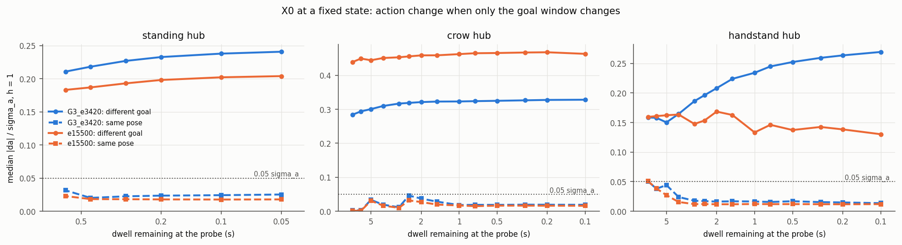
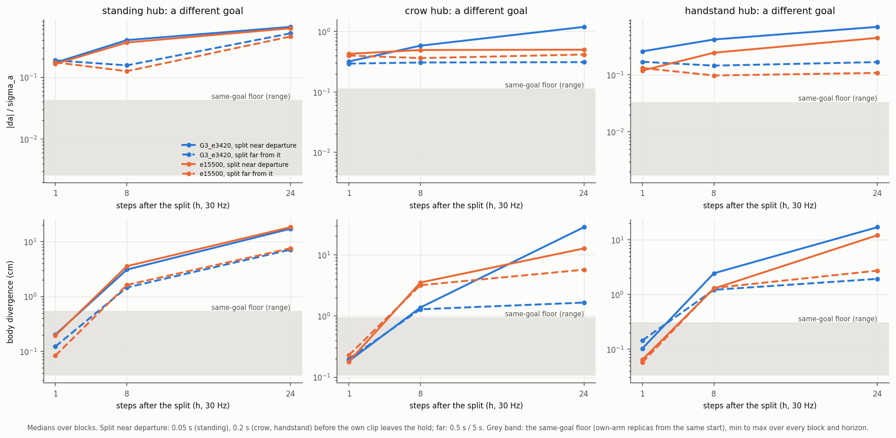
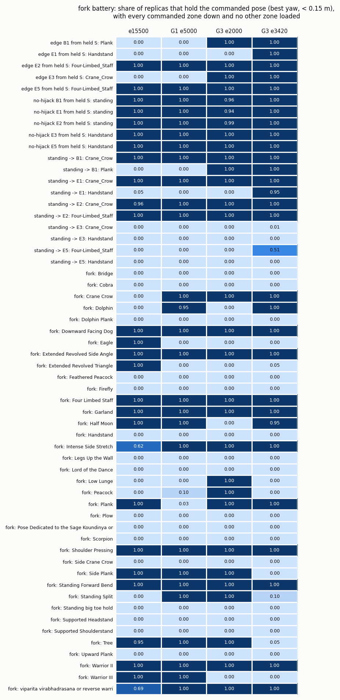

# S0, the X0 goal-causality falsifier and the fork battery, on G3's epoch 3,420 (2026-10-05)

Card S0 of [`../PLAN.MD`](../PLAN.MD) (Lane S). The teacher is G3's `epoch_3420.ckpt`
(`results/smpl_yogi_v2_expert56_g3_2f132f4299`, [`../g3/README.MD`](../g3/README.MD)); e15500
(`results/smpl_yogi_v2_expert56_a2dda5d2ac/epoch_15500.ckpt`) is the "before". The fork battery also ran on G1's
`epoch_5000` and G3's `epoch_2000`, to place what changed.

The tool is [`data/scripts/goal_causality_x0.py`](../../../data/scripts/goal_causality_x0.py); this folder holds its
collation (`compare.py`), the collated data (`data/s0_compare.json`) and three figures.

## 0. Bottom line

1. **G3's teacher passes X0 at every hub, and the card's known case reproduces.** At a fixed robot state, switching
   only the goal window to a partner's with a different commanded pose moves the action by **0.24 / 0.33 / 0.25
   σ_a** (median, near the end of the dwell) at the standing, crow and handstand hubs. Partners that command the
   same pose move it by 0.015–0.025 σ_a, so the excess is **0.21 / 0.31 / 0.24 σ_a**: 4–6 times the 0.05 σ_a
   falsification threshold. Every one of the 39,000 different-goal probes near the end of a dwell is above 0.05.
   - The card's acceptance case is the standing hub: every human clip opens standing, and slot 1 names that clip's
     first move. **Different slot-1 goals give different actions near the fork:** 0.237 against a same-pose floor of
     0.025.
   - G3's acceptance item "X0 at S states, well above 0.05 σ_a near the end of the dwell" passes at both hubs the
     new edges leave from: crow (S of E1, E2, B1) 0.31, handstand (S of E3, E5) 0.24.
2. **X0's size falsifies, it does not validate.** e15500, which never trained on a crow → handstand window, reacts
   *more* at the crow hub (0.45 σ_a). The difference is in timing:
   - G3 holds its crow while the departure is far, then executes the commanded edge: 2 cm of body divergence 24
     steps after a goal switch made 5 s before departure, 29 cm after one made 0.2 s before. e15500 drifts 5–6 cm
     from its crow whenever the unfamiliar goal is shown, and diverges only 14 cm at the departure.
   - At the handstand hub G3's response rises toward the departure (0.16 → 0.25 σ_a); e15500's falls (0.16 → 0.13).
   - The fork battery says the same: from a held source pose, e15500 and G1 execute none of E1, B1 or E3; G3
     executes all three on every replica.
3. **The paired rollouts put PhysX in its place.** Envs started from one state and driven by the same goal stay
   within 0.006–0.05 σ_a and 0.1–0.4 cm over 24 steps. A different goal reaches 0.15–1.1 σ_a and 2–29 cm. Identical
   starts are still not bit-identical after a single step (0.1 mm), so a paired design needs this floor.
4. **The fork battery (52 plans × 78 replicas, per replica and per goal, supports by terrain-filtered load).**
   - **G3 executes every new edge on command from a held source pose (1.00), and every no-hijack control passes
     (1.00).** From standing it reaches crow and continues to the plank (1.00), the chaturanga (1.00) and the
     handstand (0.95). Handstand-sourced edges from standing fail (0.00–0.51), because no fork reaches the handstand
     from standing.
   - **Family forks from standing:** the commanded hold succeeds on 16 of 37 at e15500, G1 e5000 and G3 e2000,
     with different members each time, and on **13 of 37 at G3 e3420**. G3 e3420 lost Warrior III, Tree and Side
     Plank, which pass at both e15500 and G1 (Warrior III already at G3 e2000).
   - **The shipped fork plans still carry the deadline defect recorded for expert60.** `reach_s` is measured to the
     target segment's *start*, not to the hold frame, and skips the intermediate holds. Warrior III is asked for in
     3.25 s, where training gets there in about 12.9 s through two intermediate holds. Read a single fork row as
     "under these plans", not as a capability (§4).
5. **Three traps in the shared tooling, each measured, none fixed here.**
   - **Rebuilding the observations after `env.step` (the panel, `far_swap_test.py`, `hub_swap_test.py`,
     `expert_handoff_screen.py`) zeroes the contact force rate.** `_finalize_contact_state` has already promoted
     the current forces to `previous_contact_forces`. `contact_obs_v1` moves by up to 0.78 on the rebuilt step.
     `goal_causality_x0.py` puts the pre-step sample back, and its own rebuild is then bit-identical to the
     stepped observation.
   - **`set_manual_goal` cannot express training's dwell channels.** One `hold_seconds` feeds both duration and
     remaining, so every manual probe misstates the hold duration: by 4.1 s at the median and 9.7 s at p90 over
     every scheduled slot of the release. The contact sets it serves are identical (0 of 226,730 slots differ).
   - **E2's and E5's destination (chaturanga) is reached even by e15500** from a held crow or handstand. A
     destination-hold rate does not show that those two edges were executed; E1, B1 and E3 discriminate.
6. **For Lane S: S0 passes as S2's gate.** The teacher's labels carry the goal, at the hubs and on the forks it can
   do. Before S1/S2 use manual-goal probes as acceptance:
   - fix the dwell semantics of `set_manual_goal`;
   - fix the panel's rebuild;
   - regenerate the fork plans with training's deadline.

   Then re-read G3's single-leg forks (§6).

## 1. What was built

`data/scripts/goal_causality_x0.py` runs one checkpoint in one IsaacLab process (about 12 min at 4,096 envs; the
fork part alone about 5 min) in three parts.
- **Loading.** It loads the checkpoint with its *training* config, as the card asks, and overrides the four fields
  the inference config changes: no terminations, long episodes, and no start anchoring.
- **Actor check.** It proves that the actor it loaded is the checkpoint's, tensor for tensor (18 of 18). An AMP
  agent loads a plain PPO checkpoint with `strict=False`, so this matters for the "before".
- **`--config`.** This flag runs a checkpoint under another run's config. e15500 runs under G3's, so the release-v3
  partners exist. Release v3's human part is v2's bit for bit, and the actor's inputs are the same functions.

**`corpus`.** Every human x0 clip runs from t = 0 on its own schedule, for 600 steps at 73 replicas.
- This gives σ_a, the per-DOF action standard deviation that every |Δa| is divided by: 0.119 rad mean (0.021–0.319)
  for G3, 0.124 for e15500.
- The distance is the RMS over DOF of Δa_j / σ_j, so 0.05 means 5 % of the policy's own spread on an average DOF.
- It also gives the replica drift: identical starts at different floor positions drift 0.1 mm after one step,
  1.6 mm after 100 and 4.6 mm after 600 (median). A few replicas take another outcome entirely, up to 1.7 m.

**`x0`.** Three hubs where the corpus itself presents one state with several commanded goals.

| Hub | Own clips probed | Partner segments (the hub's node, anywhere in v3) | What differs |
|---|---|---|---|
| standing | the 54 human x0 clips that open standing | the other clips' opening standing, plus the own clip's x3s/x7s | slot 1: each clip's first move |
| crow | Crow -a x7s and one x7s clip each of E1, E2, B1 | 84: Crow -a, the 72 spliced S holds, E3's arrival crow | slot 1: standing, handstand, chaturanga or plank |
| handstand | Handstand -a x7s and one x7s clip each of E3, E5 | 42: Handstand -a's two handstands, E3/E5's S holds, E1's arrival handstand | slot 1: crow, chaturanga, a step-down or standing |

- **Partner time.** A partner of the own probe (A, t_a) is a segment of the hub's node in another clip, at the clip
  time with the same dwell remaining: `t_b = t_end_B − (t_end_A − t_a)`.
- **Matching.** The partner is kept if its reference frame matches A's within 0.10 m (24-body mean, after
  anchoring). The median state gap is 0.1 cm at the crow hub, 1.8 cm at the handstand hub and 2.4 cm at the
  standing hub.
- **Anchoring.** The partner's goal window is placed by the rigid yaw + XY map that takes its hold exemplar onto
  A's. That is identity for the spliced clips, which R2 built in their source's frame, and a real transform for
  E3's arrival crow and E1's arrival handstand.
- **Strata, by the commanded pose** (6-body pelvis-relative best-yaw distance, slot by slot):
  - *identical*: the same window, e.g. the own clip's hold-extension variants;
  - *same pose*: every slot < 0.10 m; the deadline and dwell may differ;
  - *different*: some slot > 0.25 m, or a slot valid in one window only.

**h = 1 (exact).** The own clip runs from t = 0, so the probed states are the expert's own arrivals with their real
history.
- At each probe time (dwell remaining 0.6 → 0.05 s at standing, 7 → 0.1 s at the holds), the observation is rebuilt
  under every partner window **without stepping**, and the action is queried. 92,000 (state, partner) rows per
  checkpoint.
- **Self-checks, both checkpoints:**
  - the restored own window's rebuild equals the stepped observation bit for bit (max |Δ| 0.0, 172 checks);
  - no actor input outside the six goal keys changes under a partner window (0.0);
  - identical windows give the same action (≤ 3e-4 raw).

**h = 8 / 24 (paired).** 45 blocks: three dwell values per own clip, and 8 of the standing clips (the training
panel's fork families).
- Each block resets to the reference state 1 s before the split, then runs the own schedule. At the split, 2-env
  arms switch for good to up to six partners (one identical, two same-pose, the rest different goals with distinct
  slot-1 nodes); 4 own-arm envs keep the own goal.
- Actions and clip-local body positions are recorded for 24 steps.

**`forks`.** `SequenceVizRunner` drives every `fork_*`, `edge_*` and `nohijack_*` plan of the release exactly as the
training panel does: `set_manual_goal`, 10 settle steps, a re-arm every 0.5 s and a 1.2 s hold lead. All 4,096 envs
are scored (78 replicas per plan), per replica and per goal:
- the pose error after the best yaw, on the panel's 24 bodies and on the 6 goal bodies;
- the time held;
- **supports from terrain-filtered ground force.** A commanded zone is down at ≥ 5 N on ≥ 90 % of the hold window.
  A substitution is load ≥ 3 % BW on any other zone for ≥ 20 % of it, E1's rule.
- **Success** = pose held (< 0.15 m) and every commanded zone down and no substitution. Per-frame zone loads are
  saved, so other rules can be re-scored offline.

### 1.1 Where the build departs from the card

- **"At bank states (G0a)" → the expert's own on-policy states.** A bank reset writes root and joint state only.
  The observation history, the previous action and the contact sample would be the reset's, and IsaacLab does not
  refresh contact sensors on a state write (`env.reset` clears them for that reason). So the h = 1 probes run
  in flight, at the same arrivals a G0a bank would hold. The paired blocks start from a reference state 1 s before
  the split.
- **"`set_manual_goal(partner (motion, t_hold))`" → the partner's schedule.** The partner window is installed by
  switching the schedule to `(B, t_b)` and refreshing it (`ContactGraphControl._refresh_goal_indices`). This
  reproduces training's deadlines, dwell pair and contact sets exactly.
  - The manual path was measured on e15500's run. Re-issuing every env's *own* window through `set_manual_goal`
    changes exactly one actor input, `contact_goal_obs`, by up to 1.0: the dwell duration channel. The action moves
    by about 0.01 σ_a at the median.
  - Offline over the whole release, the duration channel differs by 0.41 / 0.97 (p50 / p90; 4.1 / 9.7 s), and the
    contact sets never differ (`manual_contact`'s segment rule resolves 100 %).
- **Supports in the fork battery: by contact, with load for substitutions, not load for both.** "Every commanded zone
  ≥ 3 % BW" failed floor poses whose labels include lightly resting zones: Cobra's thighs, Bridge's forearms,
  Legs-up's trunk. E1's evaluator rule scores realised supports by contact and keeps the load threshold for
  substitutions. Both columns are kept (`supports_realised`, `supports_loaded`).

## 2. X0 at h = 1



Median |Δa| / σ_a over every (own state, partner) row, far from and near the end of the dwell. Far is ≥ 0.45 s at
standing and ≥ 3 s at the holds; near is ≤ 0.2 s and ≤ 1 s.

| Hub | G3 e3420: different, far → near | same pose | excess near | e15500: different, far → near | same pose | excess near |
|---|---|---|---|---|---|---|
| standing (54 clips) | 0.214 → **0.237** | 0.022–0.025 | **0.212** | 0.185 → 0.201 | 0.018 | 0.183 |
| crow | 0.306 → **0.327** | 0.019 | **0.308** | 0.447 → 0.465 | 0.016 | 0.449 |
| handstand | 0.163 → **0.252** | 0.015–0.025 | **0.236** | 0.158 → 0.134 | 0.012–0.016 | 0.122 |

The p10 of the different-goal rows near the end is 0.14 / 0.25 / 0.14 (G3); 100 % are above 0.05 at every hub.

**What a different slot 1 does at the source holds (G3 e3420, near the end; `data/s0_compare.json`, `by_partner_goal`):**

| Own clip (its slot 1) | Partner's slot 1 → median |Δa| / σ_a |
|---|---|
| Crow -a (standing) | handstand (E1) 0.40, chaturanga (E2) 0.28, plank (B1) 0.24; **standing via E3's arrival crow (same pose, another frame) 0.02** |
| E1's crow (handstand) | standing 0.39, plank 0.34, chaturanga 0.32; another E1 variant (same pose) 0.014 |
| Handstand -a (its step-down, h2) | crow (E3) 0.21 far → **0.42** near, chaturanga (E5) 0.17 → **0.39**, standing (its second handstand's exit) 0.30; E1's arrival handstand (same continuation) 0.015 |

- **The anchoring is right.** E3's arrival crow is placed by a real yaw + XY transform, and it reads as the same
  goal as Crow -a's own: 0.02 σ_a.
- **The handstand responses double toward the departure**, as a goal-conditioned policy's should.

## 3. X0 paired: h = 1, 8, 24



Medians over blocks:
- **floor** is own-arm against own-arm, the same goal;
- **diff** is the own arm against the different-goal arms.

Distances are |Δa| / σ_a and the mean 24-body distance in the clip frame.

| Hub, split before departure | h | G3 floor: Δa / cm | G3 diff: Δa / cm | e15500 diff: Δa / cm |
|---|---|---|---|---|
| standing, 0.5 s | 24 | 0.016 / 0.2 | 0.52 / 7.1 | 0.45 / 7.6 |
| standing, 0.05 s | 24 | 0.015 / 0.3 | 0.59 / **16.4** | 0.57 / 15.0 |
| crow, 5 s | 24 | 0.043 / 0.3 | 0.33 / **2.0** | 0.41 / 5.1 |
| crow, 0.2 s | 24 | 0.021 / 0.4 | 1.10 / **28.6** | 0.50 / 14.1 |
| handstand, 5 s | 24 | 0.006 / 0.1 | 0.17 / 1.9 | 0.11 / 2.6 |
| handstand, 0.2 s | 24 | 0.019 / 0.2 | 0.69 / **17.1** | 0.47 / 12.2 |

At h = 1 the body divergence is at the floor (0.1–0.2 cm) everywhere, as it must be one step after the switch. v11
§8's original criterion was "different-goal excess at h = 24 > 0.05 σ_a". Every row passes it: G3's by at least 3×,
e15500's by at least 2×.

## 4. The fork battery



**The new edges** (success; 78 replicas):

| Plan → goal | e15500 | G1 e5000 | G3 e2000 | G3 e3420 |
|---|---|---|---|---|
| edge E1, held crow → handstand | 0.00 | 0.00 | 0.00 | **1.00** |
| edge B1, held crow → plank | 0.00 | 0.00 | 1.00 | **1.00** |
| edge E3, held handstand → crow | 0.00 | 0.00 | 1.00 | **1.00** |
| edge E2 / E5 → chaturanga | 1.00 / 1.00 | 1.00 / 1.00 | 1.00 / 1.00 | 1.00 / 1.00 |
| no-hijack, all five hubs | 1.00 | 1.00 | 0.94–1.00 | **1.00** |
| standing → crow → handstand (E1) | 0.05 | 0.00 | 0.00 | **0.95** |
| standing → crow → plank (B1) | 0.00 | 0.00 | 1.00 | **1.00** |
| standing → handstand → crow / chaturanga (E3, E5) | 0.00 | 0.00 | 0.00 | 0.01 / 0.51 |

- E1 was learnt last (G3's README §3: from about epoch 2,500); here it appears between 2,000 and 3,420.
- E2/E5's chaturanga is the attractor of coming down forward: e15500 lands there too.

**Family forks from standing** (the commanded family hold): 16 of 37 succeed at e15500, G1 e5000 and G3 e2000, and
13 of 37 at G3 e3420.

| Changed between checkpoints | e15500 | G1 e5000 | G3 e2000 | G3 e3420 |
|---|---|---|---|---|
| Crow (hands only) | 0.00 | 1.00 | 1.00 | 1.00 |
| Dolphin | 0.00 | 0.95 | 0.00 | 1.00 |
| Intense Side Stretch | 0.62 | 1.00 | 1.00 | 1.00 |
| Warrior III | 1.00 | 1.00 | **0.00** | **0.00** |
| Tree | 0.95 | 1.00 | 1.00 | **0.05** |
| Side Plank | 1.00 | 1.00 | 1.00 | **0.00** |
| Standing Split | 0.00 | 1.00 | 1.00 | 0.10 |
| Half Moon | 1.00 | 1.00 | 0.00 | 0.95 |
| Eagle (the wrapped-foot kickstand: a substitution) | 1.00 | 0.00 | 0.00 | 0.00 |
| Extended Revolved Triangle (the hand never reaches the floor) | 1.00 | 0.00 | 0.00 | 0.05 |

- **0 at all four checkpoints:** the inversions (Handstand, Pincha, Scorpion, Plow, Supported Headstand and
  Shoulderstand); Firefly, Koundinya and Side Crow; Lord of the Dance, Big Toe Hold and Upward Plank; and Legs-up,
  Bridge, Cobra and Dolphin Plank.
- **Peacock and Low Lunge succeed only at G3 e2000 (1.00).**
- **The last four hold their pose but miss a labelled support.** Legs-up holds without its trunk and forearms,
  Bridge without its forearms, Cobra without its thighs, and Dolphin Plank on its hands, which is the
  experts' known way of holding that clip.
- G3's replicas that fail Warrior III, Tree and Side Plank fall (pelvis 0.1–0.4 m). The same checkpoint tracks
  those clips at 1.00 on their own schedule (G3's README §5).

**Read the family rows through the plans' known defect.** `make_hold_graph_probe_plans.py` sets `reach_s` from the
previous segment's end to the target segment's *start*. Training's deadline runs to the hold frame, through the
clip's intermediate holds (memory note `expert60-probe-and-panel-defects`). Every plan's 4 s hold also stands
against the hold's own 0.3–2.6 s duration in training, and `set_manual_goal` then misstates that duration
(§1.1).

| Fork plan | Commanded pose (clip time) | Plan's reach | Training's route to that pose |
|---|---|---|---|
| Warrior III | 13.73 s | 3.25 s | about 12.9 s, through h1 and h2 |
| Tree | 6.47 s | 3.45 s | about 5.5 s, through h1 |
| Side Plank | 15.93 s | 8.53 s | about 15 s |
| Warrior II (passes everywhere) | 9.53 s | 5.12 s | about 8.8 s, through h1 |

The outcomes flip between checkpoints (Half Moon, Low Lunge, Standing Split above), as G3's training panels showed
for Tree and the headstand. A plan that asks for a pose several times faster than training ever did is a probe of
robustness, not of the fork.

## 5. The traps, measured

| Trap | Measured | Where it bites |
|---|---|---|
| A rebuild after `env.step` sees `previous_contact_forces` = current forces (`_finalize_contact_state` ran after the step's observation): the force rate reads 0 | `contact_obs_v1` differs from the stepped observation by up to **0.78** (G3) / 0.62 (e15500) | `SequenceVizRunner._refresh_obs` (every 0.5 s re-arm), `far_swap_test.py`, `hub_swap_test.py`, `expert_handoff_screen.py`: one step with a zeroed force rate per re-issue. Fix: rebuild against the pre-step sample (`Harness.rebuild`) |
| `set_manual_goal(hold_seconds=…)` writes the one value into both dwell channels | duration channel off by **4.1 s at p50, 9.7 s at p90** over every scheduled slot of the release; contacts identical | every manual probe and panel; the student's probes in S1/S2. Fix: a separate duration (the pose segment's `t_end − t_hold`) |
| Identical starts at different floor positions are not identical after one step | 0.1 mm after 1 step, 4.6 mm after 600 (p50); a few replicas take another outcome (up to 1.7 m) | any paired or replica design: calibrate with a same-goal arm, as here |
| A destination-hold rate at chaturanga cannot show E2 or E5 | e15500 holds both from a held S at 1.00 | edge acceptance: use the transition window (`g3/edge_tracking.py`) for E2/E5 |
| X0's magnitude does not separate a trained teacher from an untrained one | e15500 0.45 σ_a at the crow hub against G3's 0.31 | read the timing (dwell curve, paired divergence) and the fork battery beside it |

## 6. What this means for Lane S

1. **S0 passes as the gate S2 needs.** G3 e3420's labels carry the goal: at a fixed state, the commanded window moves
   the action 4–6 times above the falsification threshold, timed to the departure. Distillation is not blocked by
   a goal-blind teacher, the failure that ended the v6–v11 student rounds.
2. **Before S1 uses manual goals for probes:**
   - give `set_manual_goal` a separate duration (or derive it from the commanded pose's segment);
   - make the panel's rebuild use the pre-step contact sample.

   Lane S already owns `contact_graph_control.py` (§4.0). Re-run this script's manual-path check afterwards: it
   should report no differing actor input.
3. **Regenerate the fork plans with training's deadline before S2's acceptance uses them.** Measure to the hold
   frame, through the clip's own holds, and give each hold its own duration. Then re-run the battery on G3 e3420.
   - If Warrior III, Tree and Side Plank still fail, they are teacher failures the student will inherit.
   - Otherwise they are plan artefacts.
   - Until then, report G3's fork rows as "under the shipped plans".
4. **Deployment.** G3 e3420 for the new edges, as G3's README says. For single-leg forks under these plans, G1
   e5000 and e15500 do better. If corrected plans confirm that, S2 can route those families to a second teacher
   (`multi_expert.py` already routes by motion).

## 7. Reproduce

```bash
PY=../env_isaaclab/bin/python; D=expert_revist/graph_growth_2026_10_03/s0_x0; O=output/goal_causality_x0
G3=results/smpl_yogi_v2_expert56_g3_2f132f4299
# the teacher: corpus sigma_a + X0 + forks, about 12 min (fork part re-run with the final support rule)
PYTHONPATH=. $PY data/scripts/goal_causality_x0.py --checkpoint $G3/epoch_3420.ckpt --out-dir $O/g3_e3420
PYTHONPATH=. $PY data/scripts/goal_causality_x0.py --checkpoint $G3/epoch_3420.ckpt --parts forks --out-dir $O/g3_e3420_forks
# the before, under G3's training config (release v3)
PYTHONPATH=. $PY data/scripts/goal_causality_x0.py --checkpoint results/smpl_yogi_v2_expert56_a2dda5d2ac/epoch_15500.ckpt \
    --config $G3/resolved_configs.pt --out-dir $O/e15500
PYTHONPATH=. $PY data/scripts/goal_causality_x0.py --checkpoint results/smpl_yogi_v2_expert56_a2dda5d2ac/epoch_15500.ckpt \
    --config $G3/resolved_configs.pt --parts forks --out-dir $O/e15500_forks
# fork battery only, two more checkpoints
PYTHONPATH=. $PY data/scripts/goal_causality_x0.py --checkpoint results/smpl_yogi_v2_expert56_amp_ft_a2dda5d2ac/epoch_5000.ckpt \
    --config $G3/resolved_configs.pt --parts forks --out-dir $O/g1_e5000_forks
PYTHONPATH=. $PY data/scripts/goal_causality_x0.py --checkpoint $G3/epoch_2000.ckpt --parts forks --out-dir $O/g3_e2000_forks
# collation and figures
$PY $D/compare.py G3_e3420=$O/g3_e3420+$O/g3_e3420_forks e15500=$O/e15500+$O/e15500_forks \
    G1_e5000=$O/g1_e5000_forks G3_e2000=$O/g3_e2000_forks
```

One IsaacLab process at a time: each run takes 10.6 GB of GPU memory at 4,096 envs. Run the processes in sequence;
never start a second process beside a running one (memory note `isaaclab-render-concurrency`).

## 8. Files

| Path | What |
|---|---|
| `data/scripts/goal_causality_x0.py` | the tool (all three parts, the self-checks, the manual-path measurement) |
| `compare.py` | the collation: X0 curves, partner-goal breakdown, paired tables, fork tables, the three figures |
| `data/s0_compare.json` | the collated numbers for the four checkpoints |
| `figures/` | `x0_h1_curves.png`, `x0_paired.png`, `forks.png` |
| `output/goal_causality_x0/<run>/` (not in git) | per run: `meta.json` (checkpoint and config sha256), `corpus.json`, `x0_h1_rows.jsonl` (92k rows), `x0_paired.npz` + `x0_paired_blocks.json`, `x0_summary.json`, `forks/` (the runner's `summary.json`, `pose_error_traces.npz`, `zone_loads.npz`), `forks_scored.json`, `report.md` |
